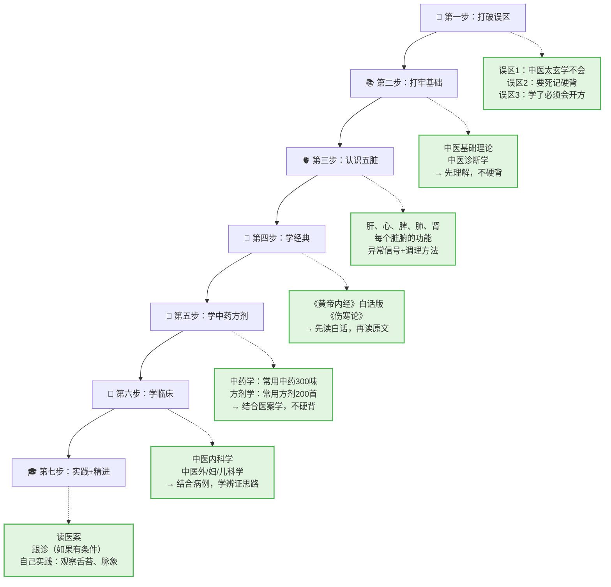

# 中医自学指南

> 献给每一位在中医学习路上摸索前行的你。
> 本指南基于北京中医药大学培养方案，结合真实自学者的经验，为中医专业学生和自学者提供**真正能自学**的保姆级指南。

<span class="md-badge md-badge--primary">📖 持续更新中</span>
<span class="md-badge md-badge--accent">🏫 参照：北京中医药大学</span>
<span class="md-badge md-badge--success">🌿 完全开源</span>

---

## 🤔 你是不是也有这些困惑？

:::caution 先别急着放弃
- **"中医太玄了，普通人学不会？"** → 错！阴阳就是白天/黑夜，五行就是五脏的关系网，大白话就能讲清楚
- **"要背的东西太多，记不住？"** → 不用死记硬背！先理解逻辑（肝属木像树，爱舒展），自然就能推导出来
- **"学了也不会把脉开方，白学？"** → 普通人学中医，重点是**读懂身体信号**（口苦=肝火旺，吃凉拉肚子=脾胃寒），能调整生活习惯就是收获
:::

---

## 🗺️ 学习路径图（保姆级）



> 💡 **重点**：不要跳步！很多自学者失败，就是因为第一步没做（心态没调整好），直接去啃《黄帝内经》，结果被文言吓退。

---

## 📋 完整学习规划（按学期）

| 学期 | 核心课程 | 学习目标 | 自学建议 |
|--------|----------|----------|----------|
| 第1学期 | 中医基础理论 | 建立中医思维，理解阴阳五行、藏象经络 | 配合生活例子理解，不要死记硬背 |
| 第2学期 | 中医诊断学 | 学会望闻问切，掌握辨证方法 | 多观察自己和家人的舌苔、脉象 |
| 第3学期 | 中药学 | 掌握300味常用中药的性味归经 | 结合《药性赋》背诵，理解为主 |
| 第4学期 | 方剂学 | 掌握200首常用方剂的组成和主治 | 理解方义（为什么这个方治这个病），不硬背 |
| 第5学期 | 中医经典（《内经》《伤寒》） | 读通经典原文，理解中医核心思想 | 先读白话版，再读原文+注解 |
| 第6学期 | 中医内科学 | 掌握常见病证的辨证论治 | 结合医案学习，看名医怎么辨证 |
| 第7-8学期 | 临床实习 + 进阶经典 | 把理论用于实践，学温病学、金匮要略 | 争取跟诊机会，多读医案 |

> 📖 **零基础自学者**：可以把每个学期的内容拆成 2-3 个月，慢慢学，不要急。

---

## 🔍 如何使用本指南

本指南按照**真实自学者的经验**编排，不是简单的资源堆砌，而是**保姆级自学教程**：

| 板块 | 内容 | 怎么用 |
|------|------|--------|
| 📚 [必修课程](index.md) | 每门课的**完整自学教程**（概念讲解+生活例子+临床意义+自测习题） | 按顺序学，每学完一章就做自测题 |
| 📜 [中医经典](index.md) | 《黄帝内经》《伤寒论》《金匮要略》《温病学》的**导读+核心篇章讲解** | 先读白话版，再读原文，配合注解 |
| 🏥 [临床课程](index.md) | 中医内/外/妇/儿科的**辨证思路+医案分析** | 结合具体病例学习，不要只背证型 |
| 💉 [针灸推拿](index.md) | 针灸学、推拿学的**入门教程+常用穴位** | 先学常用穴位，再学辨证配穴 |
| 🔬 [西医基础](index.md) | 解剖、生理、病理、药理的**重点提要** | 中医学生也要懂西医，互补学习 |
| 🛠️ [学习工具](index.md) | 文献管理、古籍数据库、穴位3D模型等**实用工具** | 提高学习效率 |
| 📒 [好书推荐](index.md) | 按学习阶段推荐的**书籍清单** | 不同阶段读不同的书，不要乱读 |
| 🔬 [研究方向](index.md) | 中医各领域的研究前沿和入门方法 | 为高年级学生和考研党准备 |

---

## ❓ 常见问题

### 🤔 零基础能自学中医吗？

**能！** 但要注意方法：

1. **先调整心态**：中医不是玄学，是古人观察自然和人体的经验总结，用大白话就能讲清楚
2. **不要死记硬背**：先理解逻辑（比如肝属木，像春天的树，爱舒展，所以生气会导致肝郁），自然就能推导出来
3. **从生活开始**：学了脾虚少吃凉，就少喝冰奶茶；学了肝火旺少熬夜，就试着11点前睡觉
4. **别追求速成**：中医是慢功夫，学3个月能看懂基础身体信号，就是很大进步

---

### 📚 应该按什么顺序学？

**推荐顺序**（来自10年自学者的经验）：

```
兴趣读物（建立兴趣）
   ↓
教材打基础（中医基础→诊断→中药→方剂）
   ↓
《伤寒论》《金匮要略》（临床核心）
   ↓
黄元御/彭子益（建立整体思维）
   ↓
温病学（补充临床短板）
   ↓
各家学说（确定深耕方向）
```

> ⚠️ **避坑**：不要一开始就学偏门流派（比如火神派），容易走偏。从综合教材开始，建立全面认知。

---

### 📖 要不要读《黄帝内经》？

**要，但别一开始就读！**

- ❌ **零基础直接读《内经》** → 90% 会放弃，因为文言太深奥
- ✅ **正确做法**：
  1. 先学完《中医基础理论》，有了基础知识
  2. 读《黄帝内经》白话版（推荐：徐文兵、《黄帝内经说什么》）
  3. 再读原文+注解（推荐：王洪图《内经讲稿》）

> 💡 很多概念（比如"正气存内，邪不可干"），学完基础再读，一下子就懂了。

---

### 🎓 学中医要不要背很多东西？

**要背，但别死记硬背！**

| 内容 | 背诵方法 | 例子 |
|------|----------|------|
| 中药 | 按功效分类背，结合《药性赋》 | 解表药：麻黄发汗，桂枝解肌，紫苏行气… |
| 方剂 | 理解方义，背方歌 | 四君子汤：参术茯苓甘草，益气健脾基础方 |
| 经典条文 | 理解后背诵，结合临床 | "太阳之为病，脉浮，头项强痛而恶寒" |

> 💡 **重点**：背的时候要**理解为什么**，比如为什么要"扶阳"，因为阳虚会怕冷、夜尿多。理解了，自然就记住了。

---

### 💊 学了也不会开方，是不是白学？

**不是！** 普通人学中医，价值在于：

1. **读懂身体信号**：口苦=肝火旺，舌淡白=血虚，吃凉拉肚子=脾胃寒
2. **调整生活习惯**：学了"脾胃怕寒"，就少喝冰饮；学了"肝主疏泄"，就少生气
3. **照顾家人**：感冒了分寒热（白稀痰=寒，黄稠痰=热），再决定喝生姜水还是菊花茶
4. **养生保健**：按揉足三里、合谷、涌泉，日常保健就能用

> 🌿 中医不是只有"会开方"才有用，学会**和自己身体相处**，就是最大的收获。

---

### 📖 推荐的书太多，不知道先读哪本？

**按学习阶段选书**（详见 [好书推荐](index.md)）：

| 阶段 | 推荐书籍 | 为什么 |
|------|----------|--------|
| 启蒙阶段 | 《求医不如求己》《温度决定生老病死》 | 大白话，建立兴趣，不被吓退 |
| 打基础 | 《中医基础理论》（规划教材）+ 教学视频 | 系统、综合，不偏激 |
| 学经典 | 《郝万山伤寒论讲稿》《刘景源温病学讲稿》 | 名家讲解，比自己啃书容易理解 |
| 进阶 | 《四圣心源》《圆运动的古中医学》 | 建立整体思维，理解中医核心逻辑 |
| 实践 | 《刘渡舟验案精选》《赵绍琴验案精选》 | 结合医案，学辨证思路 |

> ⚠️ **避坑**：不要同时读好几本书！选一本适合的，读精，再换下一本。

---

### 🔬 学中医要不要学西医？

**要！** 现代中医学生，西医知识是**必备技能**：

1. **互补诊断**：中医辨证+西医辨病，提高诊断准确性
2. **安全用药**：知道药物的西药相互作用，避免危险
3. **临床实践**：现代中医院，西医检查是常规操作
4. **学术交流**：写论文、做研究，需要西医知识

> 💡 本指南也提供 [西医基础](index.md) 板块，帮你快速掌握重点。

---

### ⏰ 每天学多久合适？

**建议：每天 1-2 小时，坚持下去比突击更重要**

| 学习强度 | 适合人群 | 预期进度 |
|----------|----------|----------|
| 每天30分钟 | 上班族/学生党 | 1年学完基础课 |
| 每天1-2小时 | 中医爱好者 | 半年学完基础课 |
| 每天3-4小时 | 立志从业的考生 | 3个月学完基础课 |

> 💡 **重点**：学中医是马拉松，不是百米冲刺。每天坚持30分钟，比一周突击10小时效果好。

---

### 🎓 学到什么程度算"入门"？

**建议的自测标准**（学完基础课后）：

- [ ] 能看到家人的舌苔，说出大概的寒热虚实
- [ ] 知道感冒要分寒热（白稀痰=寒，黄稠痰=热）
- [ ] 知道常用的10个穴位（合谷、足三里、涌泉等）在哪里、有什么用
- [ ] 能看懂基础的中医术语（气滞、血瘀、脾虚、肾虚）
- [ ] 读完《伤寒论》白话版，能理解六经辨证的基本思路

> ✅ 达到以上标准，就算入门了！后面就是**多读书、多实践、多总结**，逐步精进。

---

## 🏫 为什么参照北京中医药大学？

北京中医药大学（BUCM）是中华人民共和国成立后的第一所中医药高等学府，被誉为"中医药领域的北大"。其培养方案经过数十年打磨，课程体系完整、严谨，是国内中医药院校的重要参照标准。

本指南以 BUCM 的中医专业培养方案为蓝本，同时广泛参考上海中医药大学、广州中医药大学等院校的课程设置，力求兼顾系统性与实用性。

---

## 🤝 贡献方式

本指南是开源项目，欢迎每一位中医学子、自学者、临床医生参与贡献！

- 🐛 发现错误？[提交 Issue](https://github.com/etherealstarry/tcm-self-learning/issues)
- ✍️ 想补充内容？[提交 Pull Request](https://github.com/etherealstarry/tcm-self-learning/pulls)
- 💬 有疑问或建议？[参与讨论](https://github.com/etherealstarry/tcm-self-learning/discussions)

---

## 📜 版权声明

本指南采用 MIT 协议开源。引用内容均注明出处，如有侵权请联系删除。

---

> 🌿 *"博极医源，精勤不倦。"* —— 孙思邈《大医精诚》
