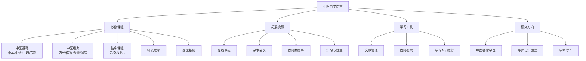

# 如何使用这本书

> 工欲善其事，必先利其器。

---

## 🎯 本书的定位

本指南既不是一本"中医速成手册"，也不是"考试重点汇总"。它的定位是：

:::info
**一份系统、详实、可操作的中医专业自学指南。**
:::

具体来说：

- ✅ **系统性**：按照北京中医药大学的完整培养方案组织内容，不遗漏核心课程
- ✅ **详实性**：每门课都有详细的知识点笔记，不只是资源链接的堆砌
- ✅ **可操作性**：每章附有学习建议、推荐资源、常见误区提醒

---

## 📖 推荐阅读顺序

### 如果你是大一新生

```
Step 1: 先读《中医基础学》→ 建立中医思维
    ↓
Step 2: 同时学《中医诊断学》→ 学会"望闻问切"
    ↓
Step 3: 《中药学》→ 认识中药，理解药性
    ↓
Step 4: 《方剂学》→ 学习配伍，理解组方思路
```

### 如果你是大三大四，准备临床实习

```
重点阅读「临床课程」板块：
  - 中医内科学（核心！）
  - 中医外/妇/儿科学
  - 同时复习四部经典的相关条文
```

### 如果你在备战执业医师资格考试

```
重点关注：
  - 「中医经典」板块的考点梳理
  - 「西医基础」板块的重点疾病
  - 各门课程的「考试指南」小节
```

---

## 🛠️ 如何高效使用本指南

### 1. 边学边记

本指南的每门课笔记，都是按照**教材章节顺序**编排的。建议：

- 上课前，先浏览对应章节的笔记，带着问题去听课
- 下课后，用自己的话补充笔记，标注老师强调的重点
- 定期回顾，用思维导图串联知识点

### 2. 善用拓展资源

每门课的页面都附有：

- 📹 **网课推荐**（B站、中国大学MOOC等平台的优质课程）
- 📚 **参考书目**（教材之外的补充读物）
- 📄 **经典论文**（了解学科前沿）

### 3. 参与讨论

遇到不懂的问题？

- 在对应页面下方留言（如果启用了评论系统）
- 到 [Discussions](https://github.com/etherealstarry/tcm-self-learning/discussions) 提问
- 加入中医学习交流群（见[后记](后记.md)）

---

## 📋 本指南的内容结构



---

## ⚠️ 几点说明

1. **本指南不能替代教材和课堂**：笔记是辅助工具，核心内容仍需以教材和老师授课为准
2. **学术观点有争议是正常的**：中医许多问题尚无定论，笔记中会标注"各家观点"
3. **持续更新中**：内容仍在不断完善，欢迎提 Issue 或 PR 贡献

---

## 🌿 写在最后

中医之学，博大精深。希望这份指南能成为你学习路上的一盏灯，照亮前行的方向。

> *"博学之，审问之，慎思之，明辨之，笃行之。"* ——《礼记·中庸》

如果有任何建议或发现错误，欢迎随时联系！

- GitHub Issues：[提交问题](https://github.com/etherealstarry/tcm-self-learning/issues)
- 邮箱：（待补充）
