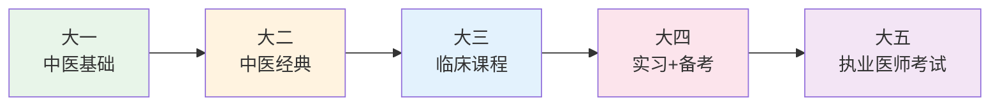

# 中医学习规划

> 中医之学，非一日之功。合理的规划，能让你的学习之路走得更稳、更远。

---

## 🎯 整体学习路线图



---

## 📅 分年级学习规划

### 大一：筑基之年

| 学期 | 核心课程 | 学习重点 | 推荐投入时间 |
|------|----------|----------|--------------|
| 第一学期 | 中医基础学、医古文、中国古代哲学与中医 | 建立中医思维，理解阴阳五行 | 每天 2-3 小时 |
| 第二学期 | 中医诊断学、正常人体解剖学、生理学 | 掌握四诊方法，理解人体结构 | 每天 2-3 小时 |

:::tip 大一学习建议
- 不要急于背诵，先理解**中医思维**（整体观、辨证论治）
- 《中医基础学》要多读几遍，每次读都有新体会
- 医古文要过关，否则读不懂经典原文
:::

---

### 大二：经典入门

| 学期 | 核心课程 | 学习重点 | 推荐投入时间 |
|------|----------|----------|--------------|
| 第三学期 | 中药学、方剂学、黄帝内经（选读） | 认识 400+ 味中药，背诵基础方 | 每天 3-4 小时 |
| 第四学期 | 中医内科学（基础）、伤寒论（选读）、金匮要略（选读） | 开始接触辨证论治，读经典原文 | 每天 3-4 小时 |

:::tip 大二学习建议
- **中药学**：按功效分类记忆，理解药性理论（四气五味、归经）
- **方剂学**：先背方歌，再理解组方原理，最后能灵活加减
- 开始读《黄帝内经》，建议配合白话翻译一起读
:::

---

### 大三：临床深化

| 学期 | 核心课程 | 学习重点 | 推荐投入时间 |
|------|----------|----------|--------------|
| 第五学期 | 中医内科学（完整）、中医外科学、温病学 | 掌握常见病辨证论治，理解温病学派 | 每天 4-5 小时 |
| 第六学期 | 中医妇科学、中医儿科学、针灸学、推拿学 | 专科疾病，针灸推拿实操 | 每天 4-5 小时 |

:::warning 大三关键任务
- 开始跟诊！找一位临床老师，定期抄方
- 把之前学的经典条文，和临床病例对应起来
- 开始准备执业医师资格考试的基础复习
:::

---

### 大四：实习与备考

- **上半年**：医院实习（内科→外科→妇科→儿科轮转）
- **下半年**：集中复习，备战执业医师资格考试

| 备考阶段 | 时间 | 重点内容 |
|----------|------|----------|
| 第一轮复习 | 3 个月 | 通读教材，建立知识框架 |
| 第二轮复习 | 2 个月 | 刷题，查漏补缺 |
| 第三轮复习 | 1 个月 | 模拟考试，调整状态 |

---

### 大五及以上（如果有）：深造或就业

- **考研方向**：中医内科学、针灸推拿学、中医基础理论等
- **就业方向**：中医医院、综合医院中医科、社区卫生服务中心
- **出国方向**：补充英语，了解境外执业政策（美国 NCCAOM、欧洲等）

---

## 📚 每日学习时间安排建议

```
🌅 早晨 6:30-7:30   背诵（方歌、药性赋、经典条文）
🏫 上午 8:00-12:00   上课 / 实习
🏫 下午 14:00-17:30  上课 / 实习
🌙 晚上 19:00-22:00   复习当天内容 + 预习明天课程
                        （其中 1 小时读经典）
💤 晚上 23:00 前      休息，保证睡眠
```

:::info 关于背诵
中医需要背诵的内容很多，建议：
- **方歌**：每天背 2-3 首，反复复习
- **药性赋**：按章节背诵，理解每味药的特点
- **经典条文**：每天 1-2 条，重在理解，不死记硬背
:::

---

## 🔗 各阶段推荐阅读

参见 [好书推荐](好书推荐.md) 页面，按学习阶段分类推荐。

---

## 📊 学习进度追踪

建议你维护一个学习进度表（可以用 Notion、Excel 或纸质笔记本）：

| 课程 | 教材读完 | 笔记完成 | 习题完成 | 经典条文背诵 | 备注 |
|------|----------|----------|------------|----------------|------|
| 中医基础学 | ✅ | ✅ | ✅ | - | |
| 中医诊断学 | ✅ | 🔄 | ⬜ | - | |
| 中药学 | 🔄 | 🔄 | ⬜ | - | 已背 200 味 |
| ... | | | | | |

图例：✅ 完成 | 🔄 进行中 | ⬜ 未开始

---

> *"不积跬步，无以至千里；不积小流，无以成江海。"* —— 荀子《劝学》
