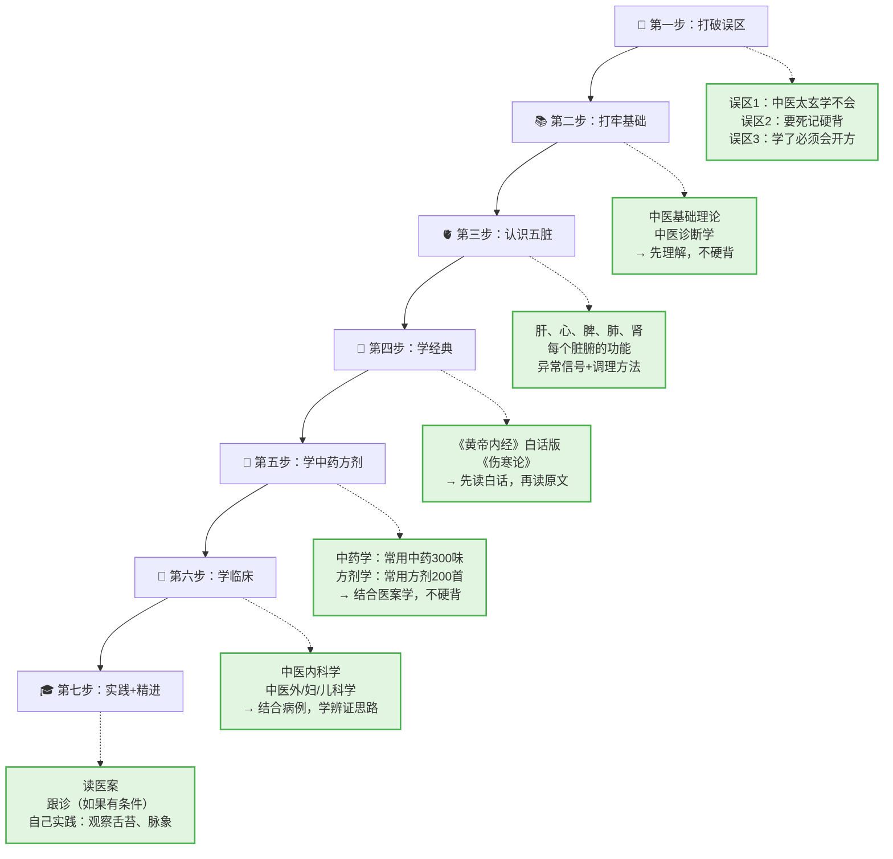

# 中医学习路径

> 本路径基于多位中医自学者的真实经验总结，旨在为你提供一条**真正能走通**的中医自学之路。
> 不要跳步！很多自学者失败，就是因为第一步没做（心态没调整好），直接去啃《黄帝内经》，结果被文言吓退。

---

## 🗺️ 完整学习路径图



> 💡 **重点**：不要跳步！很多自学者失败，就是因为第一步没做（心态没调整好），直接去啃《黄帝内经》，结果被文言吓退。

---

## 🧠 第一步：打破误区（1-2周）

### 🤔 先别急着放弃

很多想学中医的人，在**第一步就放弃了**。为什么？因为被三个误区吓到了。

#### 误区1："中医太玄了，普通人学不会"

**正解**：中医底层逻辑很实在！

| 你以为的中医 | 实际的中医 |
|-------------|------------|
| 阴阳五行很玄奥 | 阴阳就是"白天/黑夜"，五行就是"五脏的关系网" |
| 经络穴位找不到 | 合谷穴就在"手背大拇、食指并拢的骨头凹陷处"，一按就酸 |
| 脉象摸不出来 | 先学"浮沉迟数"四种基本脉象，就能判断大概 |

> 💡 **记忆方法**：把中医当成"身体的使用说明书"，不是"玄学"。

#### 误区2："要背的东西太多，记不住"

**正解**：不用死记硬背！先理解对应关系背后的逻辑。

| 要背的内容 | 理解方法 |
|-------------|----------|
| 肝属木 | 肝像春天的树，爱舒展 → 生气会导致肝郁（像树被压弯了） |
| 心属火 | 心像天上的太阳，主温煦 → 心火旺会口干、失眠（像太阳太晒了） |
| 脾属土 | 脾像土地，主运化 → 脾虚会腹胀、便稀（像土地积水不流动） |

> 💡 **记忆方法**：每个脏腑都用一个"自然现象"来类比，理解了自然就能推导出来。

#### 误区3："学了必须会把脉开方，不然白学"

**正解**：普通人学中医，重点是**读懂身体信号**，能根据信号调整生活习惯。

| 身体信号 | 中医解释 | 调整方法 |
|-------------|----------|----------|
| 口苦 | 肝火旺 | 少熬夜、喝菊花茶 |
| 吃凉就拉肚子 | 脾胃寒 | 少喝冰饮、多吃温性食物 |
| 手脚心热、盗汗 | 阴虚 | 少熬夜、吃滋阴食物（黑芝麻、枸杞） |

> 🌿 **核心思想**：学中医的价值是**学会和身体相处**，为自己的健康负责。从零开始学习本身就是很有意义的事。

---

### 📋 第一步完成标准

学完这一步，你应该能回答：

- [ ] 我知道中医不是玄学，是"观察身体和自然"的经验总结
- [ ] 我愿意先理解逻辑，不死记硬背
- [ ] 我学中医是为了读懂身体信号，不是一定要当医生

> ✅ **如果上面3个问题都能回答"是"**，就可以进入第二步了。
> ❌ **如果还有疑虑**，再去读一遍《求医不如求己》或《温度决定生老病死》，建立兴趣。

---

## 📚 第二步：打牢基础（2-3个月）

### 🎯 目标

学完《中医基础理论》和《中医诊断学》，建立中医的**世界观**和**诊断思维**。

---

### 📖 学习材料

| 材料 | 怎么用 | 重要程度 |
|------|--------|----------|
| 《中医基础理论》（规划教材） | 系统读，做笔记 | ⭐⭐⭐⭐⭐ |
| 《中医诊断学》（规划教材） | 重点读舌诊、脉诊 | ⭐⭐⭐⭐⭐ |
| B站：成都中医药大学《中医基础学》精品课 | 听老师用大白话解释 | ⭐⭐⭐⭐ |
| 《中医基础学图表解》（王天芳） | 用图表快速复习 | ⭐⭐⭐ |

---

### 🔍 具体学习方法

#### 1. 中医基础理论（重点章节）

**学习顺序**（非常重要！不要按教材章节顺序死磕）：

```
第一阶段（建立直觉）
  1. 先学「整体观念 + 辨证论治」→ 搞懂中医和其他医学最根本的区别
  2. 再学「阴阳学说」→ 先只学"阴阳是什么"，别急着学应用
    
第二阶段（建立模型）
  3. 学「五行学说」→ 用表格把五脏归属记熟
  4. 学「藏象学说」→ 一个一个脏腑来，每个脏腑画一张"功能卡片"
    
第三阶段（理解运行）
  5. 学「气血津液」→ 理解身体里的"能量"和"物质"怎么跑来跑去
  6. 学「经络学说」→ 配合针灸学一起学，效果更好
    
第四阶段（理解疾病）
  7. 学「病因病机」→ 回头看前面的模型，理解"模型怎么被破坏"
  8. 学「防治原则」→ 理解中医怎么"修复模型"
```

> 💡 **重点**：每学完一章，都要问自己："这个理论，是用来解释**什么现象**的？能解释什么**具体问题**？"

#### 2. 中医诊断学（重点章节）

**学习顺序**：

```
第一步：望诊（最直观）
  1. 望神色形态 → 先看"神"（有神/无神），再看面色、形体、姿态
  2. 望舌 → 重点！舌色、舌形、舌苔，每个都要背熟
    
第二步：闻诊 + 问诊（最实用）
  3. 闻诊 → 听声音（咳嗽、喘、噴）、闻气味（口气、痰味）
  4. 问诊 → 重点！"十问歌"要背熟（一问寒热二问汗...）
    
第三步：切诊（最难，但最有成就感）
  5. 脉诊 → 先学"浮沉迟数"四种基本脉象，再学28种常见病脉
    
第四步：辨证（综合应用）
  6. 八纲辨证 → 阴阳、表里、寒热、虚实，这是辨证的总纲
  7. 脏腑辨证 → 哪个脏腑出问题了？这是临床最常用的辨证方法
```

> 💡 **实践方法**：学完望诊，就观察自己和家人的舌苔；学完脉诊，就摸自己和家人的脉象。理论要和实践结合！

---

### 🔧 Troubleshooting（如果卡住了）

| 卡点 | 原因 | 解决方法 |
|------|------|----------|
| 阴阳五行太抽象，理解不了 | 用"自然现象"类比 | 肝属木 → 像树一样爱舒展；心属火 → 像太阳一样主温煦 |
| 藏象学说内容太多，记不住 | 死记硬背 | 每个脏腑画一张"功能卡片"，正面写功能，背面写异常信号 |
| 舌诊脉象太难，学不会 | 没有实践 | 每天观察自己和家人的舌苔、脉象，坚持1个月就有感觉 |
| 学完就忘，记不住 | 没有复习 | 用《中医基础学图表解》快速复习，每周复习一次 |

---

### 📋 第二步完成标准

学完这一步，你应该能回答：

- [ ] 能看到家人的舌苔，说出大概的寒热虚实
- [ ] 知道感冒要分寒热（白稀痰=寒，黄稠痰=热）
- [ ] 知道常用的10个穴位（合谷、足三里、涌泉等）在哪里、有什么用
- [ ] 能看懂基础的中医术语（气滞、血瘀、脾虚、肾虚）

> ✅ **如果上面4个问题都能回答**，就可以进入第三步了。
> ❌ **如果还有回答不出来的**，回去对应章节重新学，不要急着往下走。

---

## 🫀 第三步：认识五脏（1个月）

### 🎯 目标

重点掌握**肝、心、脾、肺、肾**五个核心脏腑的功能、异常信号和对应调理方法。

---

### 📖 学习内容

#### 1. 肝（将军之官）

**核心功能**：
1. **主疏泄** → 调节情绪、帮助消化、调节月经
2. **主藏血** → 储存血液、调节血量

**生活例子**：
- 肝疏泄正常 → 情绪舒畅、消化良好、月经准时
- 肝气郁结 → 爱叹气、两肋胀痛、乳房胀痛、月经不调
- 肝阳上亢 → 头晕目眩、面红目赤、急躁易怒

**异常信号**：
- 情绪抑郁或急躁 → 肝疏泄失常
- 两肋胀痛 → "肝经脉布两肋"
- 月经不调 → 肝疏泄失常影响冲任二脉
- 眼睛干涩 → "肝开窍于目"，肝血不足

**调理方法**：
- 揉太冲穴（足背侧，第一、二跖骨结合部之前凹陷处）
- 喝决明子茶（清肝明目）
- 别熬夜（23点-1点是肝经当令，要睡觉）

---

#### 2. 心（君主之官）

**核心功能**：
1. **主血脉** → 推动血液在脉管里运行
2. **主神志** → 管精神、意识、思维活动

**生活例子**：
- 心功能正常 → 面色红润、脉搏有力、精神饱满
- 心气虚 → 心悸、气短、面色苍白、脉象虚弱
- 心血虚 → 失眠多梦、健忘、面色淡白

**异常信号**：
- 心悸、心慌 → 可能心气虚或心血虚
- 失眠、多梦 → 可能心火旺或心血虚
- 舌痛、口疮 → "心开窍于舌"，心火会上炎到舌头

**调理方法**：
- 吃莲子心清心火（心火旺时）
- 喝桂圆百合水补心血（心血虚时）
- 按揉神门穴（腕横纹尺侧端，尺侧腕屈肌腱的桡侧凹陷处）

---

#### 3. 脾（仓廪之官）

**核心功能**：
1. **主运化** → 消化食物、运输营养
2. **主统血** → 控制血液在脉管内运行，不溢出
3. **主肌肉四肢** → 脾功能好，肌肉丰满、四肢有力

**生活例子**：
- 脾运化正常 → 食欲好、消化好、面色红润、肌肉丰满
- 脾虚 → 吃胀、便稀、乏力、面色萎黄、舌头有齿痕
- 脾不统血 → 便血、尿血、月经过多、皮下出血

**异常信号**：
- 腹胀、腹泻 → 脾运化失常
- 乏力、气短 → 脾主肌肉，脾虚则四肢无力
- 舌头有齿痕 → 脾虚湿盛，舌头胖大被牙齿压出痕迹
- 面色萎黄 → 脾主运化，脾虚则气血生化不足

**调理方法**：
- 少喝冰饮（脾胃怕寒）
- 多吃黄色食物（黄色入脾）
- 揉足三里穴（膝盖下3指、胫骨外侧1指处）

---

#### 4. 肺（相傅之官）

**核心功能**：
1. **主气司呼吸** → 管呼吸，吸入清气，呼出浊气
2. **主宣发肃降** → 宣发（向上向外）= 布散津液；肃降（向下向内）= 吸入清气
3. **主皮毛** → 肺功能的盛衰，表现在皮肤、汗孔
4. **主通调水道** → 肺是"水之上源"，调节津液代谢

**生活例子**：
- 肺正常 → 呼吸均匀、皮肤润泽、不易感冒
- 肺气虚 → 气短懒言、声低懒言、易感冒、自汗
- 肺热 → 咳嗽、黄痰、咽喉肿痛、鼻塞流涕

**异常信号**：
- 咳嗽、气喘 → 肺失宣降
- 皮肤差、易过敏 → "肺主皮毛"
- 鼻塞、流涕 → "肺开窍于鼻"
- 水肿（尤其上半身）→ 肺通调水道功能失常

**调理方法**：
- 深呼吸（增强肺气）
- 吃梨/银耳润肺（肺燥时）
- 喝陈皮水化痰（肺有痰湿时）

---

#### 5. 肾（作强之官）

**核心功能**：
1. **主藏精** → 藏先天之精（生殖之精）+ 后天之精（脏腑之精）
2. **主水** → 调节津液代谢（肾阳温煦脾阳，帮助运化水液）
3. **主纳气** → 帮助肺保持呼吸深度（"肾主纳气"）
4. **主骨生髓** → 肾精充足 → 骨髓充盛 → 牙齿坚固、头发乌黑

**生活例子**：
- 肾正常 → 生长发育好、生殖功能正常、骨骼强壮、听力好
- 肾阳虚 → 畏寒肢冷、夜尿多、腰膝酸软、性欲减退
- 肾阴虚 → 潮热盗汗、五心烦热、腰膝酸软、耳鸣耳聋

**异常信号**：
- 腰膝酸软 → "腰为肾之府"
- 耳鸣耳聋 → "肾开窍于耳"
- 夜尿多 → 肾阳不足，不能固摄水液
- 头发早白、脱落 → "肾其华在发"
- 小儿生长发育迟缓 → 肾精不足

**调理方法**：
- 肾阳虚：吃核桃羊肉温补，揉肾俞穴（第二腰椎棘突下，旁开1.5寸）
- 肾阴虚：吃黑芝麻枸杞滋阴，别熬夜（熬夜伤肾阴）
- 按揉涌泉穴（脚掌前1/3的凹陷处），补肾安神、改善手脚凉

---

### 🔧 Troubleshooting（如果卡住了）

| 卡点 | 原因 | 解决方法 |
|------|------|----------|
| 五个脏腑功能太多，记混了 | 没有找对类比 | 用"官职类比"：肝=将军（善谋虑），心=君主（管全身），脾=仓廪（管粮食），肺=相傅（辅佐君主），肾=作强（管力气） |
| 不知道怎么观察脏腑异常 | 没有实践 | 每天观察自己和家人的：情绪（肝）、睡眠（心）、食欲（脾）、呼吸（肺）、腰膝（肾） |
| 调理方法太多，记不住 | 没有重点 | 先学3个万能穴位：合谷（止痛）、足三里（保健）、涌泉（补肾） |

---

### 📋 第三步完成标准

学完这一步，你应该能回答：

- [ ] 五个脏腑的主要功能，每个都能说出2个临床表现
- [ ] 看到心悸、失眠 → 能想到"心"的问题
- [ ] 看到腹胀、便稀 → 能想到"脾"的问题
- [ ] 知道每个脏腑的1-2个调理方法（穴位、食物、生活习惯）

> ✅ **如果上面4个问题都能回答**，就可以进入第四步了。

---

## 📖 第四步：学经典（3-6个月）

### 🎯 目标

读通《黄帝内经》和《伤寒论》的**白话版**，理解中医核心思想，为后续学习打下基础。

---

### 📖 学习材料

| 材料 | 怎么用 | 重要程度 |
|------|--------|----------|
| 《黄帝内经说什么》（徐文兵） | 大白话讲解，建立兴趣 | ⭐⭐⭐⭐⭐ |
| 《郝万山伤寒论教学视频》 | 听名家讲解，比自己啃书容易理解 | ⭐⭐⭐⭐⭐ |
| 《伤寒论讲稿》（刘渡舟） | 系统学习伤寒论的辨证思路 | ⭐⭐⭐⭐ |
| 《金匮要略》（白话版） | 学习杂病的辨证论治 | ⭐⭐⭐⭐ |

---

### 🔍 具体学习方法

#### 1. 《黄帝内经》（先读白话版）

**为什么要学**？
- 《黄帝内经》是中医的"圣经"，奠定了中医的理论基础
- 但**不要零基础直接读原文**！90%的人会放弃，因为文言太深奥

**学习顺序**：

```
第一步：培养兴趣（1个月）
  读《黄帝内经说什么》（徐文兵）→ 大白话，像听故事一样
    
第二步：系统学习（2-3个月）
  看王洪图《内经讲稿》视频 → 系统讲解内经的核心思想
    
第三步：读原文+注解（3-6个月）
  读《内经知要》（李中梓）→ 精选内经原文，加以注解
  配合《内经教参第二版》（人民卫生出版社）→ 深入理解
```

> 💡 **重点**：很多概念（比如"正气存内，邪不可干"），学完基础再读，一下子就懂了。

#### 2. 《伤寒论》（中医临床的"宪法"）

**为什么要学**？
- 《伤寒论》是中医临床的基石，掌握了六经辨证，就能治很多常见病
- 张仲景的"六经辨证"思路，是中医临床的核心方法

**学习顺序**：

```
第一步：培养兴趣（1个月）
  读《古代的中医》（罗大伦）→ 了解张仲景和伤寒论的故事
  
第二步：系统学习（2-3个月）
  看郝万山《伤寒论教学视频》→ 名家讲解，比自己啃书容易理解
  读《伤寒论讲稿》（刘渡舟）→ 系统学习六经辨证的思路
    
第三步：精读原文（3-6个月）
  读《伤寒论》（原文+注解）→ 推荐黄元御《伤寒悬解》、尤在泾《伤寒贯珠集》
  配合《刘渡舟验案精选》→ 看名医怎么用伤寒论治病
```

> 💡 **重点**：学伤寒论，不要死记硬背条文，要理解"六经辨证"的**思路**。

#### 3. 《金匮要略》（杂病辨证论治）

**为什么要学**？
- 《金匮要略》是《伤寒论》的姊妹篇，主要讲"杂病"（内伤杂病）的辨证论治
- 掌握了《伤寒论》+《金匮要略》，就能治大部分常见病

**学习顺序**：

```
第一步：系统学习（2-3个月）
  看《金匮要略教学视频》（推荐：何任、李克光）→ 系统讲解金匮要略的核心思想
  读《金匮要略讲稿》（刘渡舟、黄元御）→ 系统学习杂病辨证思路
    
第二步：精读原文（3-6个月）
  读《金匮要略》（原文+注解）→ 推荐黄元御《金匮悬解》
  配合《赵绍琴验案精选》→ 看名医怎么用金匮要略治病
```

---

### 🔧 Troubleshooting（如果卡住了）

| 卡点 | 原因 | 解决方法 |
|------|------|----------|
| 《黄帝内经》原文太难懂 | 文言基础差，没有注解 | 先读白话版（《黄帝内经说什么》），再读原文+注解 |
| 《伤寒论》条文太多，记不住 | 死记硬背 | 理解"六经辨证"的思路，每条条文都要问"为什么" |
| 学了经典不会用 | 没有结合临床 | 读《刘渡舟验案精选》《赵绍琴验案精选》，看名医怎么用经典治病 |

---

### 📋 第四步完成标准

学完这一步，你应该能回答：

- [ ] 读完《黄帝内经》白话版，能理解"正气存内，邪不可干"等核心思想
- [ ] 读完《伤寒论》白话版，能理解"六经辨证"的基本思路
- [ ] 能看懂基础的伤寒论条文（比如"太阳之为病，脉浮，头项强痛而恶寒"）

> ✅ **如果上面3个问题都能回答**，就可以进入第五步了。

---

## 🌿 第五步：学中药方剂（2-3个月）

### 🎯 目标

掌握**300味常用中药**的性味归经，和**200首常用方剂**的组成和主治。

---

### 📖 学习材料

| 材料 | 怎么用 | 重要程度 |
|------|--------|----------|
| 《中药学》（规划教材） | 系统学习，结合《药性赋》背诵 | ⭐⭐⭐⭐⭐ |
| 《方剂学》（规划教材） | 理解方义，背方歌 | ⭐⭐⭐⭐⭐ |
| B站：张廷模《中药学》视频 | 听老师用大白话解释 | ⭐⭐⭐⭐ |
| B站：邓中甲《方剂学》视频 | 理解方义，不硬背 | ⭐⭐⭐⭐ |
| 《刘渡舟验案精选》 | 结合医案学，看名医怎么用方 | ⭐⭐⭐ |

---

### 🔍 具体学习方法

#### 1. 中药学（重点：理解药性，不硬背）

**学习顺序**：

```
第一步：理解中药的"性、味、归经"（1个月）
  性 = 四气（寒、热、温、凉）→ 治热证用寒凉药，治寒证用温热药
  味 = 五味（酸、苦、甘、辛、咸）→ 酸收敛、苦泻下、甘补益、辛发散、咸软坚
  归经 = 药物作用于哪个脏腑 → 比如柴胡归肝胆经，治肝郁
    
第二步：按功效分类学中药（1-2个月）
  解表药 → 麻黄发汗，桂枝解肌，紫苏行气...
  清热药 → 石膏清热泻火，黄连清热燥湿...
  祛湿药 → 茯苓利水渗湿，薏苡仁健脾祛湿...
  活血化瘀药 → 川芎活血行气，丹参活血祛瘀...
    
第三步：结合《药性赋》背诵（持续进行）
  解表药：《药性赋》："麻黄发汗，桂枝解肌，紫苏行气，生姜散寒..."
  每学一味药，都要想："它为什么能治这个病？"（理解药性）
```

> 💡 **记忆方法**：不要死记硬背！理解"性、味、归经"，就能推导出它的功效。

#### 2. 方剂学（重点：理解方义，不硬背）

**学习顺序**：

```
第一步：理解"方义"（1个月）
  方义 = 为什么要这样组方？→ 比如四君子汤：人参补气，白术健脾，茯苓祛湿，甘草调和
  理解方义后，自然就能记住方剂的组成和主治
    
第二步：背方歌（持续进行）
  方歌 = 把方剂的组成、功效、主治编成歌诀，方便记忆
  比如四君子汤方歌："参术茯苓甘草，益气健脾基础方"
    
第三步：结合医案学（持续进行）
  读《刘渡舟验案精选》→ 看名医怎么用方
  每学一个方，都要想："它为什么能治这个病？"（理解方义）
```

> 💡 **记忆方法**：不要死记硬背！理解"方义"，就能推导出它的组成和主治。

---

### 🔧 Troubleshooting（如果卡住了）

| 卡点 | 原因 | 解决方法 |
|------|------|----------|
| 中药太多，记不住 | 死记硬背 | 按功效分类学，理解"性、味、归经"，就能推导出它的功效 |
| 方歌背了又忘 | 没有理解方义 | 先理解"方义"，再背方歌，就不容易忘 |
| 学了中药方剂不会用 | 没有结合临床 | 读《刘渡舟验案精选》，看名医怎么用方 |

---

### 📋 第五步完成标准

学完这一步，你应该能回答：

- [ ] 知道300味常用中药的性味归经和功效
- [ ] 知道200首常用方剂的组成和主治
- [ ] 能看懂基础的方剂分析（比如"为什么四君子汤能益气健脾？"）

> ✅ **如果上面3个问题都能回答**，就可以进入第六步了。

---

## 🏥 第六步：学临床（3-6个月）

### 🎯 目标

掌握**中医内科学**的辨证思路，能治常见病（感冒、咳嗽、胃脘痛等）。

---

### 📖 学习材料

| 材料 | 怎么用 | 重要程度 |
|------|--------|----------|
| 《中医内科学》（规划教材） | 系统学习，结合医案 | ⭐⭐⭐⭐⭐ |
| 《中医外科学》《中医妇科学》《中医儿科学》 | 了解不同科的疾病特点 | ⭐⭐⭐ |
| 《刘渡舟验案精选》《赵绍琴验案精选》 | 结合医案学，看名医怎么辨证 | ⭐⭐⭐⭐ |
| B站：中医内科学教学视频 | 听老师用大白话解释 | ⭐⭐⭐ |

---

### 🔍 具体学习方法

#### 1. 中医内科学（重点：辨证思路）

**学习顺序**：

```
第一步：掌握"辨证大纲"（1个月）
  八纲辨证 → 阴阳、表里、寒热、虚实
  脏腑辨证 → 哪个脏腑出问题了？
  气血津液辨证 → 气、血、津液哪里出问题了？
    
第二步：按"病"学习（2-3个月）
  每个病都要掌握：
    1. 概念（是什么病？）
    2. 病因病机（为什么得这个病？）
    3. 辨证论治（分几个证型？每个证型用什么方？）
    
第三步：结合医案学（持续进行）
  读《刘渡舟验案精选》→ 看名医怎么辨证、怎么用方
  每学一个病，都要想："如果我是医生，我会怎么辨证？"
```

> 💡 **重点**：学临床，不要只背"证型"，要学"辨证思路"。

#### 2. 中医外/妇/儿科学（了解不同科的疾病特点）

**学习重点**：

- **中医外科学**：疮疡、皮肤病、肛门直肠疾病等
- **中医妇科学**：月经病、带下病、妊娠病、产后病等
- **中医儿科学**：小儿常见病（感冒、肺炎、腹泻等）

> 💡 **重点**：中医外/妇/儿科学，是在中医内科学的基础上，结合不同科的生理特点，所以要先学内科学。

---

### 🔧 Troubleshooting（如果卡住了）

| 卡点 | 原因 | 解决方法 |
|------|------|----------|
| 辨证思路太复杂，学不会 | 没有掌握"辨证大纲" | 先掌握"八纲辨证"和"脏腑辨证"，再学具体疾病 |
| 学了临床不会用 | 没有结合医案 | 读《刘渡舟验案精选》《赵绍琴验案精选》，看名医怎么辨证 |
| 不同科的疾病特点分不清 | 没有理解生理特点 | 先学"中医妇科学"的生理特点（月经、带下、妊娠、产后），再学疾病 |

---

### 📋 第六步完成标准

学完这一步，你应该能回答：

- [ ] 掌握中医内科学的"辨证大纲"（八纲辨证、脏腑辨证、气血津液辨证）
- [ ] 能治常见病（感冒、咳嗽、胃脘痛等）
- [ ] 能看懂基础的医案（比如"这个人是什么证？用什么方？"）

> ✅ **如果上面3个问题都能回答**，就可以进入第七步了。

---

## 🎓 第七步：实践+精进（长期）

### 🎯 目标

通过**读医案、跟诊、自己实践**，把理论用于实践，逐步精进。

---

### 📖 学习方法

#### 1. 读医案（最重要！）

**为什么要读医案**？
- 医案是"理论+实践"的结合，能让你看到**真实的辨证思路**
- 读医案，能让你学会"怎么把理论用于实践"

**推荐医案**：

| 医案 | 特点 | 怎么读 |
|------|------|--------|
| 《刘渡舟验案精选》 | 伤寒论临床大家，辨证精准 | 先自己辨证，再看答案 |
| 《赵绍琴验案精选》 | 温病学临床大家，轻灵透邪 | 学习"轻清治法"的思路 |
| 《名老中医之路》 | 多位名老中医的成长经历 | 学习他们的学习方法和临床经验 |
| 《中医人生》 | 多位中医的人生经历 | 建立对中医的感性认知 |

> 💡 **读法**：先自己辨证（这个人是什么证？用什么方？），再看答案，对比自己的思路哪里有问题。

#### 2. 跟诊（如果有条件）

**为什么要跟诊**？
- 跟诊能让你看到**真实的临床过程**（怎么问诊、怎么辨证、怎么用方）
- 跟诊能让你学到**书本上学不到的经验**

**怎么找跟诊机会**？
- 如果有认识的中医师，可以问问能不能跟诊
- 如果没有，可以去中医院挂号，观察医生怎么看病
- 也可以在网上找"学友交流"，互相讨论病例

#### 3. 自己实践（最重要！）

**为什么要自己实践**？
- 中医是"实践医学"，不动手永远学不会
- 自己实践，能让你**快速理解理论**

**怎么实践**？
- 观察自己和家人的舌苔、脉象 → 判断寒热虚实
- 小病自己治（感冒、咳嗽等） → 验证辨证思路
- 记录医案（自己或家人的病） → 总结经验教训

---

### 🔧 Troubleshooting（如果卡住了）

| 卡点 | 原因 | 解决方法 |
|------|------|----------|
| 读医案读不懂 | 理论基础不牢 | 回去复习"辨证大纲"（八纲辨证、脏腑辨证） |
| 找不到跟诊机会 | 没有人脉 | 去中医院挂号，观察医生怎么看病；或在网上找"学友交流" |
| 自己实践不敢动手 | 怕辨证错误 | 从小病开始（感冒、咳嗽等），验证辨证思路 |

---

### 📋 第七步完成标准

学完这一步，你应该能回答：

- [ ] 能读懂大部分医案，理解名医的辨证思路
- [ ] 能治常见病（感冒、咳嗽、胃脘痛等），并且有效
- [ ] 能记录医案，总结经验教训

> ✅ **如果上面3个问题都能回答**，说明你已经入门了！后面就是**多读书、多实践、多总结**，逐步精进。

---

## ⚠️ 避坑指南（来自10年自学者的经验）

### 1. 不要一开始就学偏门流派

**错误做法**：直接学火神派（重用附子、肉桂），导致形成"非附子不医"的错误认知。

**正确做法**：从综合的教材、经典开始，建立全面的基础认知。

---

### 2. 不要直接啃《内经》

**错误做法**：零基础直接读《黄帝内经》原文，结果被文言吓退，放弃学习。

**正确做法**：等有了一定临床基础、功力深厚之后再系统学，前期可以先看后世医家引用《内经》的内容，逐步积累。

---

### 3. 不要被"中医是伪科学"的观点影响

**错误做法**：读了方舟子《批评中医》，被误导，放弃学习。

**正确做法**：自己学了之后用实践验证，不要被极端观点误导。

---

### 4. 不要迷信某一派的观点

**错误做法**：认为温病学就是"寒凉伤阳"，忽视赵绍琴的温病理论（轻灵透邪）。

**正确做法**：兼听则明，温病学除了叶吴的轻清治法，还有很多其他流派的经验。

---

### 5. 不要贪多求快

**错误做法**：同时读好几本书，很多书看了一半就放下，没法深入消化。

**正确做法**：书不是读得越多越好，要读精，比如《方剂学》可以常读常新，王绵之的《方剂学讲稿》值得反复读。

---

### 6. 不要忽视教材的作用

**错误做法**：鄙视教材，认为教材太简单，直接读后世医家的著作。

**正确做法**：教材虽然被很多人诟病，但作为入门打框架的工具，它的综合性和系统性是其他书替代不了的。

---

## 📚 推荐书籍清单（按学习阶段）

### 🧠 启蒙阶段（建立兴趣）

| 书籍 | 作者 | 特点 |
|------|------|------|
| 《求医不如求己》 | 中里巴人 | 全是生活化的实用方法，易懂能直接上手用 |
| 《温度决定生老病死》 | 马悦凌 | 用大白话讲解中医的核心思想 |
| 《古代的中医》 | 罗大伦 | 通过古代名医的故事，了解中医的魅力 |
| 《思考中医》 | 刘力红 | 深入讲解中医的核心思想，适合有一定基础后读 |
| 《问中医几度秋凉》 | 艾宁 | 通过作者的亲身经历，讲述中医的魅力 |

---

### 📚 打基础阶段（建立框架）

| 书籍 | 作者 | 特点 |
|------|------|------|
| 《中医基础理论》（规划教材） | 出版社 | 系统讲解阴阳、五行、脏腑等基础概念 |
| 《中医诊断学》（规划教材） | 出版社 | 系统讲解望闻问切四诊和辨证方法 |
| 《中药学》（规划教材） | 出版社 | 系统讲解常用中药的性味归经和功效 |
| 《方剂学》（规划教材） | 出版社 | 系统讲解常用方剂的组成和主治 |
| 《中医基础学图表解》（王天芳） | 王天芳 | 用图表快速复习，适合考前冲刺 |

---

### 📖 学经典阶段（深入理论）

| 书籍 | 作者 | 特点 |
|------|------|------|
| 《黄帝内经说什么》 | 徐文兵 | 大白话讲解，适合零基础 |
| 《内经讲稿》（王洪图） | 王洪图 | 系统讲解内经的核心思想 |
| 《伤寒论教学视频》（郝万山） | 郝万山 | 名家讲解，比自己啃书容易理解 |
| 《伤寒论讲稿》（刘渡舟） | 刘渡舟 | 系统学习伤寒论的辨证思路 |
| 《金匮要略讲稿》（刘渡舟、黄元御） | 刘渡舟、黄元御 | 系统学习杂病辨证思路 |

---

### 🌿 进阶阶段（建立整体思维）

| 书籍 | 作者 | 特点 |
|------|------|------|
| 《四圣心源》（黄元御） | 黄元御 | 建立"一气周流、土枢四象、天人相应"的传统中医核心概念 |
| 《圆运动的古中医学》（彭子益） | 彭子益 | 用"圆运动"解释中医的核心思想，适合建立整体思维 |
| 《任应秋中医各家学说讲稿》 | 任应秋 | 了解中医流派演变，然后根据自己的兴趣选择方向 |

---

### 🏥 临床阶段（结合实践）

| 书籍 | 作者 | 特点 |
|------|------|------|
| 《中医内科学》（规划教材） | 出版社 | 系统学习常见病证的辨证论治 |
| 《刘渡舟验案精选》 | 刘渡舟 | 看名医怎么用伤寒论治病 |
| 《赵绍琴验案精选》 | 赵绍琴 | 看名医怎么用温病学治病 |
| 《伤寒名医验案精选》 | 出版社 | 看多位名医怎么用伤寒论治病 |

---

## 💡 最后的话

学中医是**长期过程**，不要急于求成。作者学了3年多还自认刚入门，要有长期学习的准备。

但只要你**坚持**，学完基础课后，就能看懂身体的信号，能治常见病，这就是很大的收获。

**记住**：中医不是一堆晦涩的理论，而是帮你听懂身体信号的"翻译器"。学中医的价值是**学会和身体相处**，为自己的健康负责。

从零开始学习本身就是很有意义的事，慢慢来，比较快。

---

> 🌿 *"博极医源，精勤不倦。"* —— 孙思邈《大医精诚》
