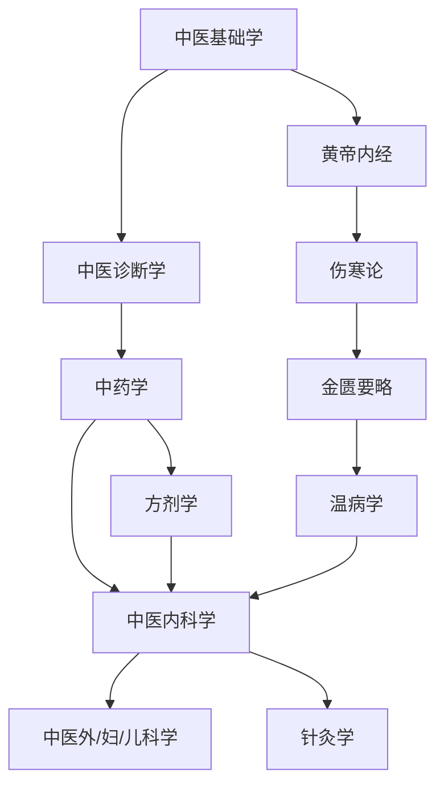

# 必修课程

> 本板块按照北京中医药大学中医专业培养方案，整理所有必修课程的学习资料。

---

## 📂 课程分类

| 类别 | 包含课程 | 说明 |
|------|----------|------|
| [中医基础](必修课程/中医基础/index.md) | 中医基础学、中医诊断学、中药学、方剂学 | 大一、大二核心基础课 |
| [中医经典](必修课程/中医经典/index.md) | 黄帝内经、伤寒论、金匮要略、温病学 | 中医四大经典，必读 |
| [临床课程](必修课程/临床课程/index.md) | 中医内科学、外科学、妇科学、儿科学 | 大三核心临床课 |
| [针灸推拿](必修课程/针灸推拿/index.md) | 经络腧穴学、针灸治疗学、推拿学 | 针灸推拿方向必修 |
| [西医基础](西医基础/index.md) | 解剖学、生理学、病理学、药理学 | 中西医并重，必学 |

---

## 🗺️ 课程学习顺序（推荐）

---

## 📋 本学期课程进度追踪

| 课程 | 当前进度 | 笔记 | 习题 | 备注 |
|------|----------|------|------|------|
| 中医基础学 | 第 X 章 | 🔄 | ⬜ | |
| 中医诊断学 | 第 X 章 | ⬜ | ⬜ | |
| ... | | | | |

图例：✅ 完成 | 🔄 进行中 | ⬜ 未开始

---

## 💡 学习建议

:::tip 基础课程学习要点
1. **中医基础学**：重在理解，建立中医思维，不要死记硬背
2. **中医诊断学**：多实践！找同学互相练习望闻问切
3. **中药学**：按功效分类记忆，理解药性理论
4. **方剂学**：先背方歌，再理解组方原理
:::

---

> *"人之所病，病疾多；而医之所病，病道少。"* ——《黄帝内经》
