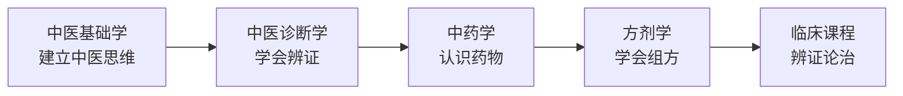
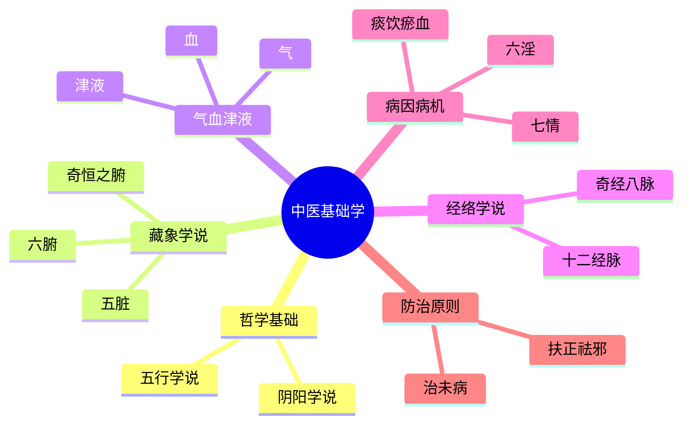

# 中医基础课程

> 中医基础课程是每一位中医人的立身之本，务必扎实掌握。

---

## 📚 课程列表

| 课程名称 | 开设学期 | 重要程度 |  notes |
|----------|----------|----------|-------|
| [中医基础学](中医基础学.md) | 第 1 学期 | ⭐⭐⭐⭐⭐ | 中医思维启蒙，重中之重 |
| [中医诊断学](中医诊断学.md) | 第 2 学期 | ⭐⭐⭐⭐⭐ | 四诊合参，辨证基础 |
| [中药学](../中药方剂/中药学.md) | 第 3 学期 | ⭐⭐⭐⭐⭐ | 400+ 味中药，需大量背诵 |
| [方剂学](../中药方剂/方剂学.md) | 第 4 学期 | ⭐⭐⭐⭐⭐ | 组方原理，配伍规律 |

---

## 🗺️ 四门课的关系

---

## 📖 学习建议

:::tip 四门基础课的学习要点
1. **中医基础学**：理解 > 背诵。重点理解阴阳五行、藏象、经络、病因病机等核心理论
2. **中医诊断学**：理论与实践结合。找同学互相练习望闻问切，多看临床病例
3. **中药学**：按功效分类记忆，理解四气五味、归经、升降浮沉等药性理论
4. **方剂学**：先背方歌，再理解组方原理，最后学会灵活加减
:::

---

## 📊 知识框架（中医基础学为例）

---

## 🔗 拓展资源

- 📹 [B站：中医基础学精品课程](https://www.bilibili.com/)（待补充具体链接）
- 📚 推荐教材：《中医基础理论》（中国中医药出版社，十二五/十三五规划教材）
- 📄 经典论文：待补充

---

> *"知其要者，一言而终；不知其要，流散无穷。"* ——《黄帝内经·素问》
