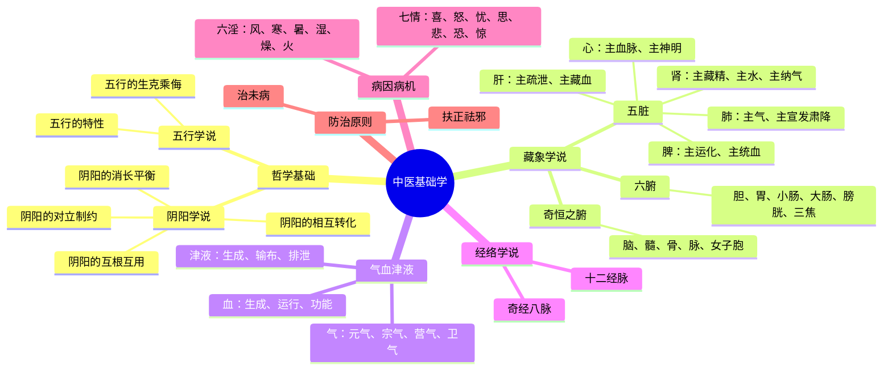

# 中医基础学

> 中医基础学是中医学的入门课程，也是整个中医理论体系的基石。

**课程基本信息**

| 项目 | 内容 |
|------|------|
| 课程名称 | 中医基础学 |
| 开设学期 | 第 1 学期（大一上） |
| 学分 | 4-5 学分（各校略有差异） |
| 教材 | 《中医基础理论》（中国中医药出版社，十四五规划教材） |
| 先修课程 | 无 |
| 后续课程 | 中医诊断学、中药学、方剂学 |

---

## 📋 课程简介

中医基础学主要介绍中医学的基本理论、基本知识和基本思维方法，包括：

- **哲学基础**：阴阳学说、五行学说
- **藏象学说**：五脏、六腑、奇恒之腑的生理功能
- **气血津液**：气、血、津液的生成、运行和功能
- **经络学说**：十二经脉、奇经八脉的走向和功能
- **病因病机**：六淫、七情、痰饮瘀血等致病因素
- **防治原则**：治未病、扶正祛邪、调整阴阳等

---

## 🗺️ 知识体系思维导图

---

## 📚 各章详细笔记

### 第一章 导论

**核心知识点**

1. **中医学的基本特点**
   - 整体观念：人体是有机整体，人与自然相统一
   - 辨证论治：辨证求因，审因论治

2. **中医学的发展历程**
   - 起源：原始社会，神农尝百草
   - 奠基：《黄帝内经》（战国至西汉）
   - 发展：张仲景《伤寒论》（东汉）、吴鞠通《温病条辨》（清）

**学习要点**
- 理解"整体观念"和"辨证论治"的真正含义
- 不要把中医思维等同于"经验医学"

---

### 第二章 阴阳学说

**核心知识点**

1. **阴阳的基本概念**
   - 阴阳是对自然界相互关联的某些事物和现象对立双方的概括
   - 规定：运动的、外向的、上升的、温热的、明亮的、功能的 → 属阳
   - 规定：静止的、内守的、下降的、寒冷的、晦暗的、物质的 → 属阴

2. **阴阳学说的基本内容**
   - 阴阳的对立制约
   - 阴阳的互根互用
   - 阴阳的消长平衡
   - 阴阳的相互转化

3. **阴阳学说在中医学的应用**
   - 说明人体的组织结构
   - 说明人体的生理功能
   - 说明人体的病理变化
   - 用于疾病的诊断
   - 用于疾病的防治

**记忆口诀**
> 阴阳对立又互根，消长转化规律存。
> 组织结构分阴阳，生理功能要靠它。
> 病理变化阴阳偏，诊断防治不离它。

---

### 第三章 五行学说

**核心知识点**

1. **五行的基本概念**
   - 木、火、土、金、水五种物质的运动变化
   - 五行特性：木曰曲直、火曰炎上、土爰稼穑、金曰从革、水曰润下

2. **五行的生克乘侮**
   - 相生：木生火、火生土、土生金、金生水、水生木
   - 相克：木克土、土克水、水克火、火克金、金克木
   - 相乘：过分克制（倍克）
   - 相侮：反向克制（反克）

3. **五行学说在中医学的应用**
   - 归属五脏系统
   - 说明五脏的生理联系
   - 说明五脏的病理影响
   - 指导疾病的诊断与治疗

**五行归属表**

| 五行 | 五脏 | 五腑 | 五官 | 五体 | 五志 | 五季 |
|------|------|------|------|------|------|------|
| 木 | 肝 | 胆 | 目 | 筋 | 怒 | 春 |
| 火 | 心 | 小肠 | 舌 | 脉 | 喜 | 夏 |
| 土 | 脾 | 胃 | 口 | 肉 | 思 | 长夏 |
| 金 | 肺 | 大肠 | 鼻 | 皮 | 悲 | 秋 |
| 水 | 肾 | 膀胱 | 耳 | 骨 | 恐 | 冬 |

---

### 第四章 藏象学说（重点！⭐⭐⭐⭐⭐）

**核心知识点**

#### 五脏

**心**
- 主血脉：推动血液在脉管中运行
- 主神明：主持精神、意识、思维活动
- 在体合脉，其华在面，开窍于舌，在志为喜，在液为汗

**肝**
- 主疏泄：调畅气机、促进血液运行和津液输布、促进脾胃运化和胆汁分泌、调畅情志
- 主藏血：贮藏血液、调节血量、防止出血
- 在体合筋，其华在爪，开窍于目，在志为怒，在液为泪

**脾**
- 主运化：运化水谷、运化水液
- 主统血：固摄血液在脉管中运行，防止溢出脉外
- 在体合肉，主四肢，其华在唇，开窍于口，在志为思，在液为涎

**肺**
- 主气：主呼吸之气、主一身之气
- 主宣发肃降：宣发卫气、肃降肺气
- 主行水：通调水道，下输膀胱
- 朝百脉，主治节
- 在体合皮，其华在毛，开窍于鼻，在志为悲，在液为涕

**肾**
- 藏精，主生长、发育与生殖
- 主水：主持和调节水液代谢
- 主纳气：摄纳肺吸入的清气，防止呼吸表浅
- 在体合骨，生髓，其华在发，开窍于耳及二阴，在志为恐，在液为唾

**记忆口诀（五脏功能）**
> 心主血脉神明官，肝主疏泄藏血全。
> 脾主运化统血行，肺主气司呼吸连。
> 肾藏精气主水纳，五脏六腑保安然。

---

### 第五章至第十二章

> 📝 **笔记正在完善中**，每章将包含：
> - 核心知识点梳理
> - 重点难点解析
> - 记忆口诀
> - 经典原文引用
> - 常见考题类型

---

## 📖 经典原文选读

> **《黄帝内经·素问·生气通天论》**
> "阳气者，若天与日，失其所则折寿而不彰。"

> **《黄帝内经·素问·调经论》**
> "五脏之道，皆出于经隧，以行血气。"

---

## 💡 学习技巧

:::tip 中医基础学学习四步法
1. **理解优先**：不要死记硬背，先理解每个理论的含义
2. **画图辅助**：藏象学说可以画画思维导图，把五脏联系起来
3. **联系临床**：学完每个理论，想一个临床例子（比如"肝主疏泄"→ 情绪抑郁→ 肝气郁结）
4. **定期复习**：每周复习一次本周内容，用 Anki 辅助记忆
:::

---

## 🔗 拓展资源

### 📹 网课推荐

| 课程 | 平台 | 讲师 | 推荐指数 | 链接 |
|------|------|------|----------|------|
| 中医基础学 | 中国大学MOOC | 北京中医药大学 | ⭐⭐⭐⭐⭐ | （待补充） |
| 中医基础理论 | B站 | 成都中医药大学 | ⭐⭐⭐⭐ | （待补充） |

### 📚 参考书目

1. 《中医基础理论》（中国中医药出版社，十四五规划教材）—— **必读**
2. 《中医学概论》（李其忠 主编）—— 帮助理解中医思维
3. 《中医思维十讲》（祝世讷 著）—— 深入理解中医方法论

### 📄 经典论文

> 待补充：推荐 3-5 篇关于中医基础理论研究的经典论文

---

## 📝 常见考题类型

### 选择题示例

**题目**：下列各项中，属于阴的是（ ）
A. 运动的　　B. 温热的　　C. 明亮的　　D. 寒冷的　　E. 向上的

点击查看答案

答案：D

解析：根据阴阳的分类规定，寒冷的属阴，其他各项均属阳。

### 简答题示例

**题目**：简述肝的主要生理功能。

点击查看答案要点

1. **主疏泄**：
   - 调畅气机
   - 促进血液运行和津液输布
   - 促进脾胃运化和胆汁分泌排泄
   - 调畅情志
2. **主藏血**：
   - 贮藏血液
   - 调节血量
   - 防止出血

---

## 📊 学习进度追踪

| 章节 | 核心内容 | 笔记完成 | 习题完成 | 掌握程度 |
|------|----------|------------|------------|----------|
| 第一章 导论 | 中医特点、发展历程 | ⬜ | ⬜ | ☆☆☆☆☆ |
| 第二章 阴阳学说 | 阴阳基本概念、运用 | ⬜ | ⬜ | ☆☆☆☆☆ |
| 第三章 五行学说 | 生克乘侮、五脏归属 | ⬜ | ⬜ | ☆☆☆☆☆ |
| 第四章 藏象学说 | 五脏功能（重点！） | ⬜ | ⬜ | ☆☆☆☆☆ |
| 第五章 气血津液 | 气、血、津液的功能 | ⬜ | ⬜ | ☆☆☆☆☆ |
| ... | | | | |

图例：⬜ 未开始　🟨 进行中　✅ 已完成
掌握程度：☆☆☆☆☆（1-5星）

---

## 💬 留言与讨论

> 如果你在学习中医基础学的过程中遇到问题，欢迎到 [Discussions](https://github.com/etherealstarry/tcm-self-learning/discussions) 提问！

---

> *"知其要者，一言而终；不知其要，流散无穷。"* ——《黄帝内经·素问》
