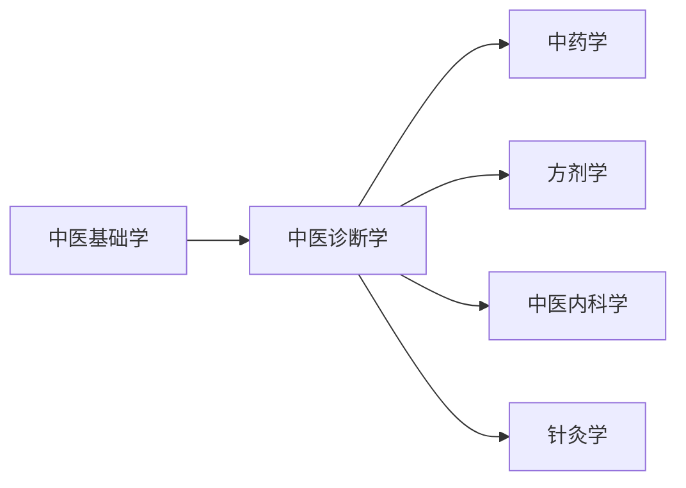

# 中医诊断学

???+ abstract "课程简介"
    中医诊断学是中医学的核心基础课程，主要学习如何通过**望、闻、问、切**四诊收集病情资料，并通过**八纲辨证、脏腑辨证、六经辨证**等方法分析病因病机，最终作出诊断。

    这门课是连接中医基础理论与临床各科的桥梁——**基础学告诉你"人体正常是什么样"，诊断学告诉你"病态是什么样"**，是真正开始"当医生"的第一步。

---

## 📚 课程资源

### 视频课程

| 来源 | 链接 | 特点 |
|------|------|------|
| 成都中医药大学（精品课） | [B站：中医诊断学](https://www.bilibili.com/) | 邓中甲团队主讲，深入浅出 |
| 中医药大学慕课合集 | [中国大学MOOC](https://www.icourse163.org/) | 系统完整，适合跟学 |
| 倪海厦中医诊断 | [B站](https://www.bilibili.com/) | 临床视角强，适合有一定基础后看 |

> 💡 **建议**：先看成都中医药大学的系统课打基础，再看倪海厦的临床讲解加深理解。

### 教材

| 教材 | 主编 | 出版社 | 推荐理由 |
|------|------|--------|------|
| 《中医诊断学》（"十四五"规划教材） | 李灿东 | 中国中医药出版社 | **首选**，中医院校标准教材，内容权威 |
| 《中医诊断学》（第十版） | 邓铁涛 主审 | 上海科学技术出版社 | 老版经典，邓老团队编写，深度更好 |
| 《中医诊断学图表解》 | 王天芳 | 中国中医药出版社 | 图表形式总结，适合复习背诵 |

> 📖 **怎么选**：在校生直接用学校发的规划教材；自学者推荐"十四五"规划教材 + 《图表解》配合使用。

### 参考书籍

- 《中医诊断学临床实训》—— 强化四诊操作技能
- 《濒湖脉学》（李时珍）—— 脉诊必读经典
- 《医宗金鉴·四诊心法要诀》—— 四诊精华总结，古文但极精炼

---

## 🗺️ 学习路径



> ⚠️ **先修要求**：必须先学完《中医基础学》（阴阳五行、脏腑经络、病因病机等），否则诊断学的内容会很难理解。

**学习顺序建议**：

1. **先学四诊**（望闻问切）—— 这是"收集信息"的部分，相对具体，容易入门
2. **再学辨证**（八纲、脏腑、六经等）—— 这是"分析信息"的部分，需要基础学的理论支撑
3. **最后综合练习**—— 拿真实病例（医案）练习从四诊到辨证的完整过程

---

## 🔑 核心重点

### 四诊精华速记

#### 望诊：看出来的健康密码

**望神**：看一个人的"精气神"
- **有神**：目光明亮、反应灵敏、表情自然 → 说明正气充足，病情轻
- **无神**：目光呆滞、表情淡漠、反应迟钝 → 说明正气大伤，病情重
- **假神**：本来昏迷突然清醒、本来不吃东西突然想吃 → **这是回光返照！**不是好转，是危重信号

> 💡 **生活例子**：家里老人卧床很久，突然有一天精神特别好，坐起来说话，要吃东西 → 这时候**千万不要高兴太早**，要立刻送医院！这就是"假神"，是生命最后的挣扎。

**望色**：看面色判断病性
- **青色**：主寒证、痛证、瘀血、惊风 → 比如肚子痛得脸色发青、跌打损伤局部发青
- **赤色**：主热证 → 满面通红=实热（ like 高热）；两颧潮红=虚热（like 肺结核午后潮热）
- **黄色**：主虚证、湿证 → 萎黄无光=脾胃虚；黄疸=湿热或寒湿
- **白色**：主虚证、寒证、失血 → 苍白=血虚或失血；晄白=阳虚（like 休克）
- **黑色**：主肾虚、水饮、瘀血 → 黑眼圈=肾虚；面色黧黑=慢性肾病

> 💡 **临床意义**：望色最怕"涂了口红、化了妆"！一定要在自然光下看**本色**。女患者来诊，**必须卸妆**才能准确望色。

#### 闻诊：听声音+嗅气味

**听声音**：
- **语声**：语声高亢、多言=阳证、实证、热证；语声低微、少言=阴证、虚证、寒证
- **咳嗽**：咳声重浊、痰声漉漉=痰湿咳嗽；干咳无痰、声音清脆=燥咳或阴虚
- **喘促**：喘息气粗、不能平卧=实喘（like 哮喘发作）；喘息无力、但卧不得=虚喘（like 心衰）

> 💡 **生活例子**：同样的"咳嗽"，在中医听来完全不同：
> - 感冒咳嗽：咳声重，有痰音，说明是"实证"（病邪盛）
> - 肺结核咳嗽：干咳，声音轻，说明是"虚证"（肺阴虚）
> 治疗方向完全不同！

**嗅气味**：
- 口气臭秽=胃热；口气酸腐=食积；口气腥臭=肺痈（肺脓肿）
- 痰涕腥臭=肺热；大便臭秽=湿热；小便臊臭=湿热下注

#### 问诊：十问歌的实战应用

十问歌不是死记硬背，而是**临床实战框架**！

**一问寒热**：
- 恶寒发热同时出现=表证（like 感冒）
- 但热不寒=里热证（like 肺炎高热）
- 但寒不热=里寒证（like 阳虚怕冷）
- 寒热往来=半表半里证（like 疟疾、少阳病）

> 💡 **临床意义**：问寒热能**第一眼分辨表证还是里证**！这是辨证的第一步，错了后面全错。

**二问汗**：
- 自汗（白天不动也出汗）= 气虚或阳虚
- 盗汗（晚上睡觉出汗）= 阴虚
- 大汗淋漓+四肢厥冷=亡阳（休克！急症！）

> ⚠️ **红旗警告**：盗汗+午后低热+消瘦 → 高度怀疑**肺结核或淋巴瘤**，必须建议病人去做检查！

**三问头身**：
- 头痛连项（后脑勺痛）= 太阳经
- 两侧头痛（太阳穴附近）= 少阳经
- 前额痛=阳明经
- 头顶痛=厥阴经

> 💡 **生活例子**：同样是"头痛"，中医要分经论治：
> - 后脑勺痛：用羌活、防风（太阳经引经药）
> - 两侧痛：用柴胡、黄芩（少阳经引经药）
> 不懂经络，头痛治不好！

#### 切诊：脉诊+按诊

**脉诊入门**（28种脉象先掌握8种基本）：
- **浮脉**：轻按即得，重按稍减 → 主表证（like 感冒初期）
- **沉脉**：轻按不得，重按始得 → 主里证（病在脏腑）
- **迟脉**：一息三至（<60次/分）→ 主寒证
- **数脉**：一息六至（>90次/分）→ 主热证
- **虚脉**：举按无力 → 主虚证（气血阴阳都虚）
- **实脉**：举按有力 → 主实证（邪气盛）
- **滑脉**：如盘走珠 → 主痰饮、食积、妊娠
- **涩脉**：如轻刀刮竹 → 主瘀血、精伤、血少

> 💡 **生活例子**：同样是"脉搏快"：
> - 运动后脉搏快=生理性，没事
> - 安静时脉搏快（数脉）+ 发热=热证，要清热
> - 安静时脉搏快（数脉）+ 盗汗+舌红少苔=阴虚，要滋阴
> 不能只看"快不快"，还要看"为什么快"！

**按诊**：
- 按皮肤：热在浅表=扪之灼手；热在深层=初扪不热，久扪灼热
- 按腹部：腹痛喜按=虚证；腹痛拒按=实证
- 按肿块：坚硬固定=恶性的可能性大；柔软可移=良性的可能性大

> ⚠️ **红旗警告**：发现"坚硬、固定、无痛"的肿块 → **必须建议病人去做病理检查**！不能当成普通痰核处理。

### 辨证体系框架

辨证是中医诊断的核心——**收集信息（四诊）→ 分析信息（辨证）→ 得出结论（证候）**。

#### 八纲辨证：总纲中的总纲

八纲是**所有辨证的基础**，就像"坐标系"一样，先把病位、病性、邪正对比定下来。

**阴阳（总纲）**：
- **阴证**：面色苍白、畏寒肢冷、声低懒言、大便溏薄、小便清长、舌淡苔白、脉沉迟无力
- **阳证**：面红目赤、发热口渴、声高气粗、大便秘结、小便短赤、舌红苔黄、脉浮数有力

> 💡 **生活例子**：同样是"发热"：
> - 发热但怕冷、手脚冰凉、喜欢喝热水=**阴证**（阳虚发热）
> - 发热不怕冷、口渴喜冷饮、小便黄=**阳证**（阳盛发热）
> 治疗完全不同：阴证要"温阳"（like 附子、干姜）；阳证要"清热"（like 石膏、知母）。

**表里（病位深浅）**：
- **表证**：恶寒发热、头痛身痛、鼻塞流涕、舌苔薄白、脉浮 → 病在体表（like 感冒初期）
- **里证**：但热不寒或但寒不热、口渴、便秘或腹泻、舌红苔黄或白厚、脉沉 → 病在脏腑（like 肺炎、肠胃炎）

> ⚠️ **临床意义**：表证→发汗（like 麻黄汤）；里证→清里热或温里寒（like 白虎汤、理中汤）。**辨错表里，治疗方向全错！**

**寒热（病性）**：
- **寒证**：畏寒肢冷、口不渴或喜热饮、大便溏薄、小便清长、舌淡苔白、脉迟
- **热证**：发热口渴、喜冷饮、大便秘结、小便短赤、舌红苔黄、脉数

> 💡 **生活例子**：同样是"腹痛"：
> - 腹痛喜温喜按、得热痛减=**寒证**（like 脾胃虚寒）→ 用干姜、附子
> - 腹痛拒按、得冷稍减=**热证**（like 胃肠积热）→ 用大黄、黄连

**虚实（邪正盛衰）**：
- **实证**：邪气盛、正气未虚 → 发热、腹胀痛拒按、痰多、脉有力
- **虚证**：正气虚、邪气不盛 → 低热、腹痛喜按、声低懒言、脉无力

> 💡 **临床意义**：实证→攻邪（like 承气汤泻下）；虚证→扶正（like 四君子汤补气）。**虚证用攻邪药会越治越虚！**

#### 脏腑辨证：临床最核心的辨证方法

脏腑辨证是把"八纲"落实到具体脏腑——**哪个脏腑出问题了？是虚是实？是寒是热？**

**心病辨证**：
- **心气虚/心阳虚**：心悸、气短、自汗、舌淡苔白、脉虚 → 治以益气养心（like 炙甘草汤）
- **心血虚/心阴虚**：心悸、失眠、多梦、健忘、舌红少苔（阴虚）、舌淡苔白（血虚）→ 治以养血安神（like 归脾汤、天王补心丹）
- **心火亢盛**：口舌生疮、心烦失眠、小便短赤 → 治以清心泻火（like 导赤散）

> 💡 **生活例子**：同样是"心悸"：
> - 心悸+气短+自汗+舌淡=**心气虚** → 要补气（人参、黄芪）
> - 心悸+失眠+多梦+舌红少苔=**心阴虚** → 要滋阴养血（酸枣仁、麦冬）
> 不能一见心悸就用安神药，必须辨证！

**肺病辨证**：
- **肺气虚**：咳嗽无力、气短懒言、自汗易感 → 治以补益肺气（like 补肺汤）
- **肺阴虚**：干咳少痰、潮热盗汗、口干咽燥 → 治以滋阴润肺（like 百合固金汤）
- **风寒束肺**：咳嗽痰稀白、恶寒发热、鼻塞流涕 → 治以疏风散寒（like 杏苏散）
- **痰热壅肺**：咳嗽痰黄稠、胸痛、口渴、舌红苔黄腻 → 治以清热化痰（like 清金化痰汤）

**脾胃病辨证**：
- **脾气虚**：腹胀纳呆、大便溏薄、神疲乏力、舌淡苔白 → 治以健脾益气（like 参苓白术散）
- **脾阳虚**：腹胀纳呆、腹痛喜温喜按、大便溏薄、畏寒肢冷 → 治以温中健脾（like 理中汤）
- **胃阴虚**：胃脘隐痛、饥不欲食、口干咽燥、舌红少苔 → 治以滋阴养胃（like 益胃汤）
- **食积胃脘**：脘腹胀满、嗳腐吞酸、大便臭秽 → 治以消食导滞（like 保和丸）

> 💡 **生活例子**：同样是"腹胀"：
> - 腹胀+大便溏薄+乏力=**脾气虚** → 要吃健脾的（like 山药、茯苓）
> - 腹胀+嗳腐吞酸+大便臭=**食积** → 要吃消食的（like 山楂、神曲）
> 吃反了会加重！

**肝病辨证**：
- **肝气郁结**：情志抑郁、胸胁胀痛、善太息（喜欢叹气）→ 治以疏肝解郁（like 柴胡疏肝散）
- **肝火上炎**：头痛目赤、烦躁易怒、口苦 → 治以清肝泻火（like 龙胆泻肝汤）
- **肝阴虚**：头晕目眩、两目干涩、五心烦热 → 治以滋阴养肝（like 一贯煎）
- **肝阳上亢**：头晕目眩、头胀头痛、烦躁易怒、失眠多梦 → 治以平肝潜阳（like 天麻钩藤饮）

> ⚠️ **临床意义**：现代人压力大，**肝气郁结**非常常见！表现为"情绪不好+胸胁胀痛+喜欢叹气"。这时候不能"补"，要"疏泄"（like 逍遥丸）。

**肾病辨证**：
- **肾阳虚**：腰膝酸软、畏寒肢冷、阳痿早泄、小便清长 → 治以温补肾阳（like 金匮肾气丸）
- **肾阴虚**：腰膝酸软、头晕耳鸣、潮热盗汗、遗精早泄 → 治以滋补肾阴（like 六味地黄丸）
- **肾精不足**：生长发育迟缓、智力低下、腰膝酸软、耳鸣耳聋 → 治以补肾填精（like 河车大造丸）

> 💡 **生活例子**：同样是"腰膝酸软"：
> - 腰膝酸软+畏寒肢冷+小便清长=**肾阳虚** → 要吃温补的（like 金匮肾气丸）
> - 腰膝酸软+潮热盗汗+舌红少苔=**肾阴虚** → 要吃滋阴的（like 六味地黄丸）
> 吃反了会上火或更加怕冷！

#### 六经辨证：伤寒专用

六经辨证是张仲景《伤寒论》独创的辨证体系，专门用来辨"外感病"（主要是伤寒）。

**太阳病**：恶寒发热、头痛身痛、舌苔薄白、脉浮 → 病在体表（like 感冒初期）
**阳明病**：高热、大汗、口渴、便秘、舌红苔黄燥、脉洪大 → 病在胃肠（like 肺炎、肠胃炎）
**少阳病**：寒热往来、胸胁苦满、心烦喜呕、口苦咽干 → 病在半表半里（like 疟疾、胆囊炎）
**太阴病**：腹满而吐、食不下、自利、时腹自痛 → 脾胃虚寒（like 急性肠胃炎）
**少阴病**：脉微细、但欲寐（总想睡觉）、恶寒蜷卧 → 心肾阳虚（like 休克早期）
**厥阴病**：消渴、气上撞心、心中疼热、饥而不欲食 → 寒热错杂（like 慢性胃炎、消化性溃疡）

> 💡 **临床意义**：六经辨证最适合"外感发热"性疾病。比如流行性感冒，按六经辨证：
> - 初期恶寒发热=太阳病 → 用麻黄汤、桂枝汤
> - 如果进展到高热、大汗、口渴=阳明病 → 用白虎汤
> - 如果出现寒热往来、胸胁苦满=少阳病 → 用大柴胡汤

#### 卫气营血辨证：温病专用

卫气营血辨证是清代叶天士创立的，专门用来辨"温病"（发热性疾病，like 新冠、流感、肺炎）。

**卫分证**：发热、微恶风寒、头痛、咳嗽、咽喉肿痛 → 病在体表（like 感冒初期）
**气分证**：高热、不恶寒、口渴、大汗、舌红苔黄、脉洪大 → 病已入里（like 肺炎高热期）
**营分证**：身热夜甚、心烦不寐、斑疹隐隐、舌红绛 → 热已伤营（like 败血症早期）
**血分证**：斑疹紫暗、出血倾向、神昏谵语、舌深绛 → 热已伤血（like DIC、重症感染）

> ⚠️ **红旗警告**：出现"斑疹隐隐"或"斑疹紫暗"→ 说明热邪已伤营血，**必须立刻送医院**！不能在家自行处理。

---

## 🃍 十问歌 {#十问歌}

> 💡 这是中医问诊的核心框架，**必须背熟**！

```
一问寒热二问汗，三问头身四问便，
五问饮食六胸腹，七聋八渴俱当辨，
九问旧病十问因，再兼服药参机变，
妇女尤必问经期，迟速闭崩皆可见。
```

**逐句解释**：

| 问项 | 目的 | 示例 |
|------|------|------|
| 一问寒热 | 分辨表证/里证/虚实 | 恶寒发热=表证；但热不寒=里热 |
| 二问汗 | 辨表里虚实 | 自汗=气虚；盗汗=阴虚 |
| 三问头身 | 辨病位病性 | 头痛连项=太阳经；头晕目眩=肝阳上亢 |
| 四问便 | 辨脾胃肠肾功能 | 便溏=脾虚；便秘=肠胃热 |
| 五问饮食 | 辨胃气盛衰 | 纳呆=脾胃虚；消谷善饥=胃热 |
| 六问胸腹 | 辨脏腑病位 | 胸闷=胸阳不振；腹痛喜按=虚证 |
| 七聋八渴 | 辨肾与津液 | 耳聋=肾虚；口渴多饮=热盛伤津 |
| 九问旧病 | 辨宿疾与现病关系 | 旧有肝病，现又发病=肝病复发 |
| 十问因 | 辨病因（外感/内伤/外伤） | 因受凉发病=寒邪；因情志发病=肝郁 |

---

## 📝 学习建议

### 难点突破

!!! warning "脉诊是最大难点"
    28种脉象初学者很难区分，建议：
    1. **先掌握8种基本脉象**：浮、沉、迟、数、虚、实、滑、涩
    2. **结合图谱和视频**：看书上的文字描述很抽象，B站有"摸脉模拟"视频
    3. **有机会多实践**：帮同学、家人摸脉，感受"浮取""沉取"的差别
    4. **不要急于求成**：脉诊需要长期临床积累，学生阶段重点是理解"脉象产生的机理"

!!! tip "舌诊相对容易入门"
    - 买一套**舌诊图谱**（人民卫生出版社有出），对照真实舌头练习
    - 注意：**舌诊最怕"灯光色偏"**，最好在自然光下观察
    - 先分"舌质"（反映正气）和"舌苔"（反映邪气），再细分

### 学习方法

1. **理论 + 实践结合**：每学一个辨证方法，就找对应医案来练习诊断
2. **背歌诀但要理解**：十问歌、二十八脉歌诀要背，但更要理解"为什么这个脉象对应这个病机"
3. **画思维导图**：把四诊内容整理成导图，帮助建立整体框架
4. **模拟诊疗**：找同学互相"看病"，一方扮演患者描述症状，一方练习四诊和辨证

---

## 🔗 参考资料

### 在线工具

- [中医舌诊图谱在线](https://example.com) — 真实舌象图片库（需自行搜索可用资源）
- [脉象模拟练习](https://example.com) — 交互式脉诊学习工具

### 推荐拓展阅读

| 书名 | 作者 | 适合阶段 |
|------|------|----------|
| 《中医诊断学》规划教材配套练习集 | 李灿东 | 初学者，巩固基础 |
| 《中医辨证论治精华》 | 王永炎 | 有一定基础后，提升辨证能力 |
| 《名老中医医案精选》 | 各医家 | 临床实习阶段，学习大师如何辨证 |

### 相关课程

- 学完本课程后，建议继续学习：
  - [中医内科学](../临床课程/中医内科学.md) — 将诊断技能应用于具体疾病
  - [中医经典：伤寒论](../中医经典/伤寒论研读指南.md) — 六经辨证的源头
  - [针灸学](../针灸推拿/针灸治疗学.md) — 经络辨证与针灸诊断

---

## 📋 自测习题

!!! question "习题1"
    患者恶寒发热，无汗，头痛，身痛，舌苔薄白，脉浮紧。请问：
    
    1. 病位在表还是在里？（答：在表，脉浮为表证）
    2. 病性属寒还是属热？（答：属寒，无汗、身痛、脉紧为寒）
    3. 邪正力量对比是实还是虚？（答：属实，正气未虚，寒邪外袭）
    
    **结论**：太阳伤寒表实证（八纲：表、寒、实证）

!!! question "习题2"
    患者面色苍白，神疲乏力，语声低微，舌质淡，苔薄白，脉虚无力。请问辨证结论？
    
    **提示**：从气血阴阳虚损角度分析 → [点击看答案](#)（建议自己思考后再看）

---

> 📬 如果你发现本课程有任何错误、或过时的资源链接，欢迎在 [GitHub提Issue](https://github.com/etherealstarry/tcm-self-learning/issues) 或直接在页面右上角点击"Edit this page"修改！
