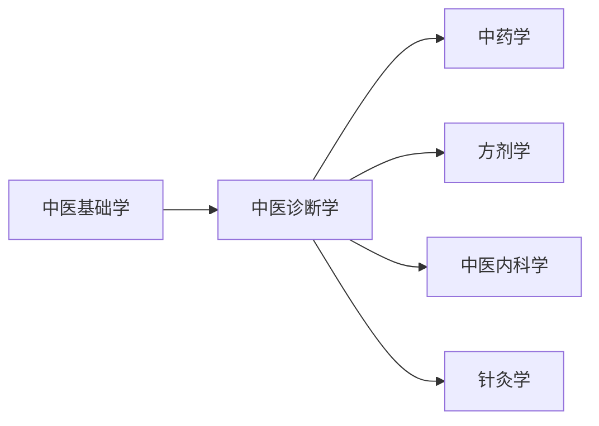

# 中医诊断学

???+ abstract "课程简介"
    中医诊断学是中医学的核心基础课程，主要学习如何通过**望、闻、问、切**四诊收集病情资料，并通过**八纲辨证、脏腑辨证、六经辨证**等方法分析病因病机，最终作出诊断。

    这门课是连接中医基础理论与临床各科的桥梁——**基础学告诉你"人体正常是什么样"，诊断学告诉你"病态是什么样"**，是真正开始"当医生"的第一步。

---

## 📚 课程资源

### 视频课程

| 来源 | 链接 | 特点 |
|------|------|------|
| 成都中医药大学（精品课） | [B站：中医诊断学](https://www.bilibili.com/) | 邓中甲团队主讲，深入浅出 |
| 中医药大学慕课合集 | [中国大学MOOC](https://www.icourse163.org/) | 系统完整，适合跟学 |
| 倪海厦中医诊断 | [B站](https://www.bilibili.com/) | 临床视角强，适合有一定基础后看 |

> 💡 **建议**：先看成都中医药大学的系统课打基础，再看倪海厦的临床讲解加深理解。

### 教材

| 教材 | 主编 | 出版社 | 推荐理由 |
|------|------|--------|------|
| 《中医诊断学》（"十四五"规划教材） | 李灿东 | 中国中医药出版社 | **首选**，中医院校标准教材，内容权威 |
| 《中医诊断学》（第十版） | 邓铁涛 主审 | 上海科学技术出版社 | 老版经典，邓老团队编写，深度更好 |
| 《中医诊断学图表解》 | 王天芳 | 中国中医药出版社 | 图表形式总结，适合复习背诵 |

> 📖 **怎么选**：在校生直接用学校发的规划教材；自学者推荐"十四五"规划教材 + 《图表解》配合使用。

### 参考书籍

- 《中医诊断学临床实训》—— 强化四诊操作技能
- 《濒湖脉学》（李时珍）—— 脉诊必读经典
- 《医宗金鉴·四诊心法要诀》—— 四诊精华总结，古文但极精炼

---

## 🗺️ 学习路径



> ⚠️ **先修要求**：必须先学完《中医基础学》（阴阳五行、脏腑经络、病因病机等），否则诊断学的内容会很难理解。

**学习顺序建议**：

1. **先学四诊**（望闻问切）—— 这是"收集信息"的部分，相对具体，容易入门
2. **再学辨证**（八纲、脏腑、六经等）—— 这是"分析信息"的部分，需要基础学的理论支撑
3. **最后综合练习**—— 拿真实病例（医案）练习从四诊到辨证的完整过程

---

## 🔑 核心重点

### 四诊精华速记

| 诊法 | 核心要点 | 记忆口诀 |
|------|----------|----------|
| **望诊** | 望神、望色、望形态、望舌 | "神色形态舌，全身局部看" |
| **闻诊** | 听声音（咳、喘、呕、呃逆）、嗅气味 | "声清多表证，声重多里寒" |
| **问诊** | 十问歌（一问寒热二问汗...） | [十问歌全文](#十问歌) |
| **切诊** | 脉诊（28种脉象）、按诊 | "脉诊先分浮沉迟数，再辨虚实弦滑" |

### 辨证体系框架

```
八纲辨证（总纲）
    ├── 阴阳（总纲中的总纲）
    ├── 表里（病位深浅）
    ├── 寒热（病性）
    └── 虚实（邪正盛衰）

脏腑辨证（临床最核心）
    ├── 心病辨证（心悸、失眠、心烦）
    ├── 肺病辨证（咳、喘、痰）
    ├── 脾病辨证（腹胀、泄泻、水肿）
    ├── 肝病辨证（胁痛、情志、月经不调）
    ├── 肾病辨证（腰膝酸软、水肿、耳鸣）
    └── 六腑辨证

六经辨证（伤寒专用）
卫气营血辨证（温病专用）
三焦辨证（温病专用）
```

---

## 🃍 十问歌

> 💡 这是中医问诊的核心框架，**必须背熟**！

```
一问寒热二问汗，三问头身四问便，
五问饮食六胸腹，七聋八渴俱当辨，
九问旧病十问因，再兼服药参机变，
妇女尤必问经期，迟速闭崩皆可见。
```

**逐句解释**：

| 问项 | 目的 | 示例 |
|------|------|------|
| 一问寒热 | 分辨表证/里证/虚实 | 恶寒发热=表证；但热不寒=里热 |
| 二问汗 | 辨表里虚实 | 自汗=气虚；盗汗=阴虚 |
| 三问头身 | 辨病位病性 | 头痛连项=太阳经；头晕目眩=肝阳上亢 |
| 四问便 | 辨脾胃肠肾功能 | 便溏=脾虚；便秘=肠胃热 |
| 五问饮食 | 辨胃气盛衰 | 纳呆=脾胃虚；消谷善饥=胃热 |
| 六问胸腹 | 辨脏腑病位 | 胸闷=胸阳不振；腹痛喜按=虚证 |
| 七聋八渴 | 辨肾与津液 | 耳聋=肾虚；口渴多饮=热盛伤津 |
| 九问旧病 | 辨宿疾与现病关系 | 旧有肝病，现又发病=肝病复发 |
| 十问因 | 辨病因（外感/内伤/外伤） | 因受凉发病=寒邪；因情志发病=肝郁 |

---

## 📝 学习建议

### 难点突破

!!! warning "脉诊是最大难点"
    28种脉象初学者很难区分，建议：
    1. **先掌握8种基本脉象**：浮、沉、迟、数、虚、实、滑、涩
    2. **结合图谱和视频**：看书上的文字描述很抽象，B站有"摸脉模拟"视频
    3. **有机会多实践**：帮同学、家人摸脉，感受"浮取""沉取"的差别
    4. **不要急于求成**：脉诊需要长期临床积累，学生阶段重点是理解"脉象产生的机理"

!!! tip "舌诊相对容易入门"
    - 买一套**舌诊图谱**（人民卫生出版社有出），对照真实舌头练习
    - 注意：**舌诊最怕"灯光色偏"**，最好在自然光下观察
    - 先分"舌质"（反映正气）和"舌苔"（反映邪气），再细分

### 学习方法

1. **理论 + 实践结合**：每学一个辨证方法，就找对应医案来练习诊断
2. **背歌诀但要理解**：十问歌、二十八脉歌诀要背，但更要理解"为什么这个脉象对应这个病机"
3. **画思维导图**：把四诊内容整理成导图，帮助建立整体框架
4. **模拟诊疗**：找同学互相"看病"，一方扮演患者描述症状，一方练习四诊和辨证

---

## 🔗 参考资料

### 在线工具

- [中医舌诊图谱在线](https://example.com) — 真实舌象图片库（需自行搜索可用资源）
- [脉象模拟练习](https://example.com) — 交互式脉诊学习工具

### 推荐拓展阅读

| 书名 | 作者 | 适合阶段 |
|------|------|----------|
| 《中医诊断学》规划教材配套练习集 | 李灿东 | 初学者，巩固基础 |
| 《中医辨证论治精华》 | 王永炎 | 有一定基础后，提升辨证能力 |
| 《名老中医医案精选》 | 各医家 | 临床实习阶段，学习大师如何辨证 |

### 相关课程

- 学完本课程后，建议继续学习：
  - [中医内科学](./../临床课程/中医内科学.md) — 将诊断技能应用于具体疾病
  - [中医经典：伤寒论](./../中医经典/伤寒论.md) — 六经辨证的源头
  - [针灸学](./../针灸推拿/针灸学.md) — 经络辨证与针灸诊断

---

## 📋 自测习题

!!! question "习题1"
    患者恶寒发热，无汗，头痛，身痛，舌苔薄白，脉浮紧。请问：
    
    1. 病位在表还是在里？（答：在表，脉浮为表证）
    2. 病性属寒还是属热？（答：属寒，无汗、身痛、脉紧为寒）
    3. 邪正力量对比是实还是虚？（答：属实，正气未虚，寒邪外袭）
    
    **结论**：太阳伤寒表实证（八纲：表、寒、实证）

!!! question "习题2"
    患者面色苍白，神疲乏力，语声低微，舌质淡，苔薄白，脉虚无力。请问辨证结论？
    
    **提示**：从气血阴阳虚损角度分析 → [点击看答案](#)（建议自己思考后再看）

---

> 📬 如果你发现本课程有任何错误、或过时的资源链接，欢迎在 [GitHub提Issue](https://github.com/etherealstarry/tcm-self-learning/issues) 或直接在页面右上角点击"Edit this page"修改！
