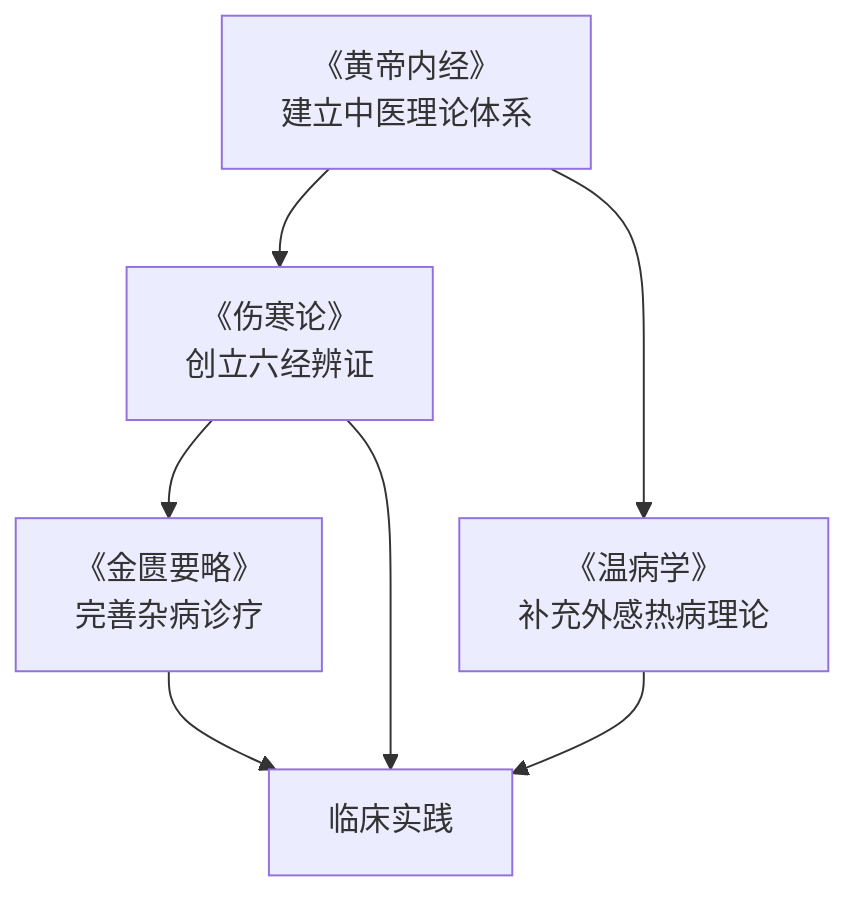

# 中医经典

> 中医四大经典，乃中医学的根与魂。熟读经典，是每一位中医人的必修课。

---

## 📜 四大经典

| 经典 | 成书年代 | 作者 | 地位 | 学习顺序 |
|------|----------|------|------|----------|
| [黄帝内经](必修课程/中医经典/黄帝内经.md) | 战国至西汉 | 多人汇集 | 中医理论之祖 | 第 1 部，必读 |
| [伤寒论](必修课程/中医经典/伤寒论.md) | 东汉 | 张仲景 | 辨证论治之祖 | 第 2 部，必读 |
| [金匮要略](必修课程/中医经典/金匮要略.md) | 东汉 | 张仲景 | 杂病诊疗之祖 | 第 3 部，必读 |
| [温病学](必修课程/中医经典/温病学.md) | 明清 | 吴鞠通等 | 外感热病诊疗 | 第 4 部，必读 |

---

## 🗺️ 四部经典的学习关系

---

## 📖 学习建议

:::tip 经典学习四步法
1. **第一步：读白话翻译**，理解大意，不纠结字词
2. **第二步：对照原文**，逐句精读，标注重点条文
3. **第三步：结合教材**，参考规划教材的释义和按语
4. **第四步：联系临床**，把条文和病案对应起来
:::

---

## 📊 条文背诵计划

| 经典 | 核心条文数 | 建议背诵周期 | 每日任务 |
|------|------------|--------------|----------|
| 黄帝内经 | 约 100 条 | 1 学期 | 每天 1-2 条 |
| 伤寒论 | 约 112 条 | 1 学期 | 每天 1-2 条 |
| 金匮要略 | 约 80 条 | 1 学期 | 每天 1 条 |
| 温病学 | 约 50 条 | 半学期 | 每天 1 条 |

---

## 🔗 拓展资源

- 📹 [B站：黄帝内经讲解](https://www.bilibili.com/)（待补充具体链接）
- 📹 [B站：刘渡舟伤寒论讲稿](https://www.bilibili.com/)（待补充）
- 📚 推荐教材：《内经选读》《伤寒论选读》《金匮要略选读》《温病学》（中国中医药出版社）
- 📄 经典注本推荐（见各课程详细页面）

---

## 💡 历代名家名言

> *"夫《黄帝内经》十八卷，《伤寒论》十卷，皆出自仲景。"* —— 王叔和

> *"《伤寒论》法学，启万世之章程。"* —— 喻嘉言

> *"读经不如读注，读注不如读案。"* —— 中医谚语

---

> *"博极医源，精勤不倦。"* —— 孙思邈《大医精诚》
