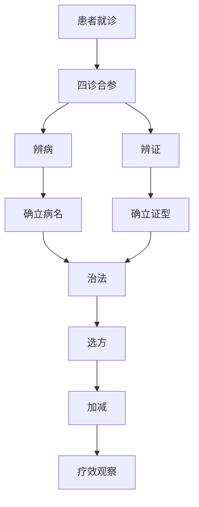

# 临床课程

> 将基础理论应用于临床实践，是中医学习的关键阶段。

---

## 📚 课程列表

| 课程名称 | 开设学期 | 重要程度 | 说明 |
|----------|----------|----------|-------|
| [中医内科学](必修课程/临床课程/中医内科学.md) | 第 5 学期 | ⭐⭐⭐⭐⭐ | 最核心的临床课，执业医师考试重点 |
| [中医外科学](必修课程/临床课程/中医外科学.md) | 第 6 学期 | ⭐⭐⭐⭐ | 疮疡、皮肤病、肛肠病等 |
| [中医妇科学](必修课程/临床课程/中医妇科学.md) | 第 6 学期 | ⭐⭐⭐⭐ | 经带胎产，妇科杂病 |
| [中医儿科学](必修课程/临床课程/中医儿科学.md) | 第 6 学期 | ⭐⭐⭐ | 儿科常见病，五脏辨证 |

---

## 🗺️ 内科辨证论治框架

---

## 📖 学习建议

:::tip 内科学习要点
1. **以证为本**：每个病都要掌握常见证型、治法、代表方
2. **病证结合**：先辨病，再辨证，不可偏废
3. **多跟诊**：theory is gray, life is green——临床经验不可替代
4. **建立病案库**：把遇到的典型病例记录下来，定期复习
:::

---

## 📋 内科常见病学习进度

| 疾病 | 常见证型 | 代表方 | 掌握程度 |
|--------|----------|--------|----------|
| 感冒 | 风寒、风热、暑湿 | 荆防败毒散、银翘散 | ⬜ 未开始 |
| 咳嗽 | 外感、内伤 | 三拗汤、桑菊饮 | ⬜ 未开始 |
| 胸痹 | 心血瘀阻、痰浊闭阻 | 血府逐瘀汤、瓜蒌薤白半夏汤 | ⬜ 未开始 |
| ... | | | |

图例：✅ 掌握 | 🔄 复习中 | ⬜ 未开始

---

## 🔗 拓展资源

- 📹 [B站：中医内科学精品课程](https://www.bilibili.com/)（待补充）
- 📚 推荐教材：《中医内科学》（中国中医药出版社）
- 📄 经典医案：待补充

---

> *"熟读王叔和，不如临证多。"* —— 中医谚语
