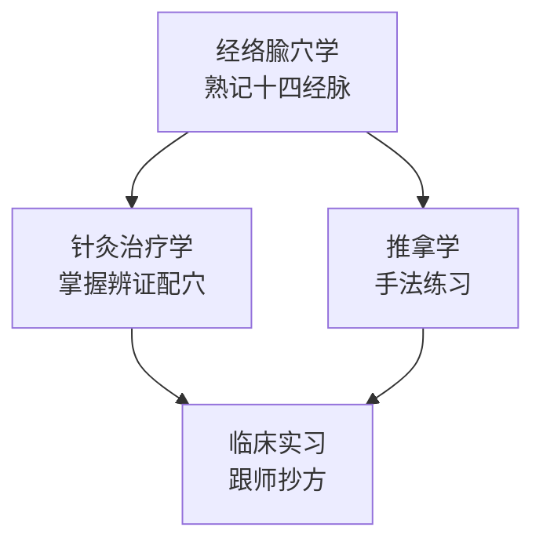

# 针灸推拿

> 针灸推拿是中医学的重要组成部分，以经络腧穴理论为基础，操作简便，疗效确切。

---

## 📚 课程列表

| 课程名称 | 开设学期 | 重要程度 | 说明 |
|----------|----------|----------|-------|
| [经络腧穴学](必修课程/针灸推拿/经络腧穴学.md) | 第 5 学期 | ⭐⭐⭐⭐⭐ | 经络走向、腧穴定位，需大量记忆 |
| [针灸治疗学](必修课程/针灸推拿/针灸治疗学.md) | 第 6 学期 | ⭐⭐⭐⭐⭐ | 各科疾病的针灸辨证论治 |
| [推拿学](必修课程/针灸推拿/推拿学.md) | 第 6 学期 | ⭐⭐⭐⭐ | 推拿手法、常见病治疗 |

---

## 🗺️ 针灸学习路径



---

## 📖 学习建议

:::tip 针灸推拿学习要点
1. **经络腧穴学**：对着人体模型或自己身体找穴位，反复摸认
2. **针灸治疗学**：重点掌握常见病的主穴、配穴规律
3. **推拿学**：手法要练！每天练 15 分钟基本手法（按、揉、推、拿）
4. **多临床**：针灸是手艺活，针感、手感只能在实践中获得
:::

---

## 🧠 十四经脉记忆口诀（节选）

```
手太阴肺经：中府云门天府诀，侠白尺泽孔最列……
手阳明大肠经：商阳二间三间合谷，阳溪偏历温溜下廉……
足阳明胃经：承泣四白巨髎穴，地仓大迎颊车边……
```
（完整口诀见[经络腧穴学](必修课程/针灸推拿/经络腧穴学.md)）

---

## 🔗 拓展资源

- 📹 [B站：针灸学精品课程](https://www.bilibili.com/)（待补充具体链接）
- 📚 推荐教材：《经络腧穴学》《针灸治疗学》《推拿学》（中国中医药出版社）
- 📄 经典论文：待补充

---

> *"经脉者，所以能决死生、处百病、调虚实，不可不通。"* ——《黄帝内经·灵枢》
