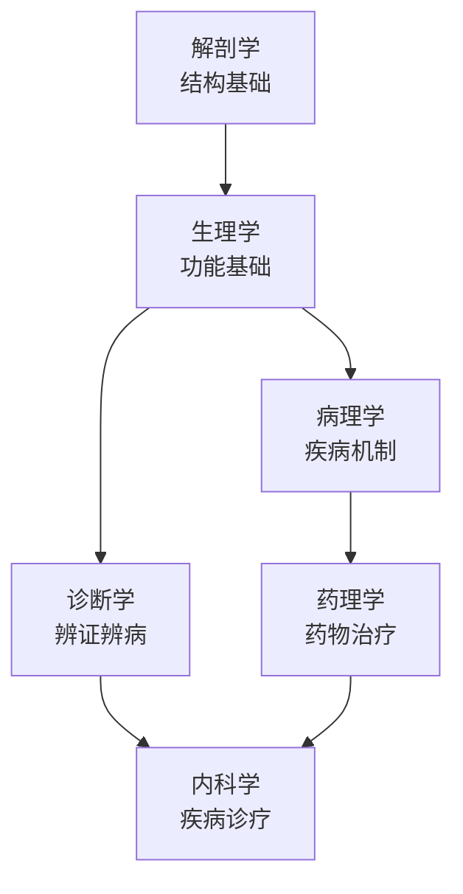

# 西医基础

> 现代中医教育强调"中西医并重"。扎实的西医基础，是成为合格中医师的必要条件。

---

## 📚 课程列表

| 课程名称 | 开设学期 | 重要程度 | 说明 |
|----------|----------|----------|-------|
| [正常人体解剖学](解剖学.md) | 第 2 学期 | ⭐⭐⭐⭐ | 认识人体结构，针灸推拿必备 |
| [生理学](生理学.md) | 第 2 学期 | ⭐⭐⭐⭐⭐ | 理解人体正常功能 |
| [病理学](病理学.md) | 第 3 学期 | ⭐⭐⭐⭐ | 理解疾病发生机制 |
| [药理学](药理学.md) | 第 3 学期 | ⭐⭐⭐⭐ | 中西药合理联用 |
| [诊断学](诊断学.md) | 第 4 学期 | ⭐⭐⭐⭐⭐ | 西医诊断基础，执业医师必考 |
| [内科学](内科学.md) | 第 5 学期 | ⭐⭐⭐⭐⭐ | 中医内科的重要参照 |

---

## 🗺️ 西医课程学习顺序

---

## 📖 学习建议

:::tip 西医基础课学习要点
1. **解剖学**：结合图谱和标本，立体记忆，重点掌握解剖标志
2. **生理学**：理解为主，搞清楚每个生理过程的机制和调节
3. **病理学**：重点掌握各种疾病的病理变化特点
4. **诊断学**：多实践！体格检查技能必须过关
5. **内科学**：和中医内科学对照学习，理解中西医各自优势
:::

---

## 🔗 中西医结合学习要点

| 中医概念 | 对应西医概念 | 学习建议 |
|----------|----------------|----------|
| 脏腑辨证 | 器官系统疾病 | 对照学习，理解异同 |
| 气血津液 | 血液循环、体液平衡 | 用西医知识解释中医理论 |
| 六淫致病 | 病原微生物、物理化学因素 | 理解病因的现代医学解释 |
| 辨证论治 | 个体化治疗 | 中西医都强调个体化 |

---

## 🔍 拓展资源

- 📹 [B站：系统解剖学精品课程](https://www.bilibili.com/)（待补充具体链接）
- 📹 [B站：生理学精品课程](https://www.bilibili.com/)（待补充）
- 📚 推荐教材：《系统解剖学》《生理学》《病理学》《药理学》《诊断学》《内科学》（人民卫生出版社，规划教材）
- 📄 中西医结合研究论文：待补充

---

> *"西为中用，古为今用。"* —— 中西医结合方针
